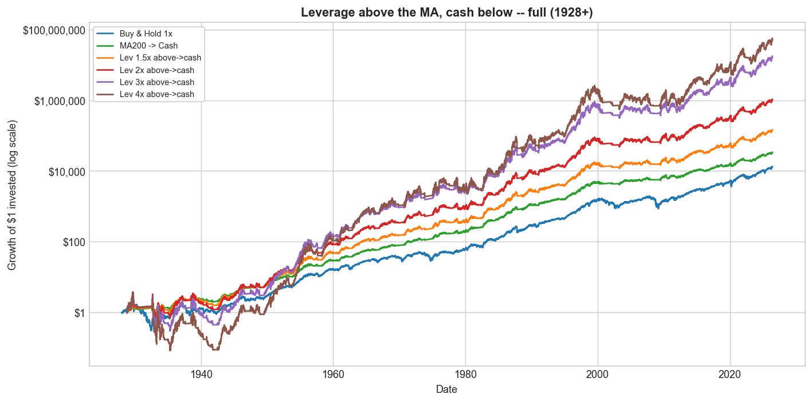
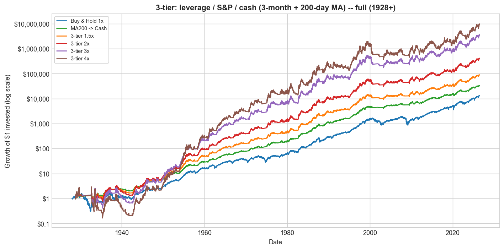
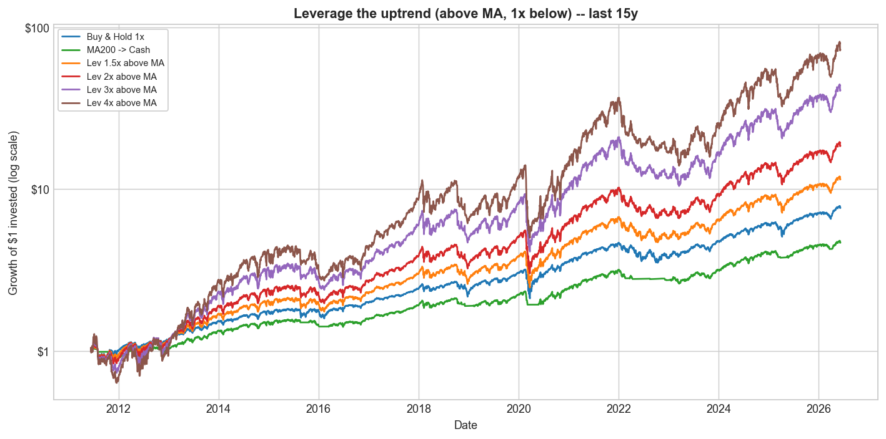

# Trend Following, Leveraged Re-Entry, and Volatility Decay

### Can daily-leveraged S&P 500 exposure improve long-term returns?

A small, readable, **reproducible** quantitative-research project, built from
scratch in Python (no black-box backtesting frameworks). It tests one trend
signal — the **200-day moving average** (the daily twin of Mebane Faber's 10-month
rule) — on S&P 500 **total return**, as far back as the data allows, and then asks
what happens when you switch leverage on and off with it.

> ⚠️ **Educational research only — not investment advice.** Leveraged ETFs are
> high-risk instruments that can lose most of their value. Past performance — real
> or simulated — does not predict the future.

---

## TL;DR — what I found

1. **The 200-day MA adds real risk-adjusted value.** Moving to cash below the
   trend keeps the return while roughly **halving the worst drawdown** (Sharpe
   0.60 vs 0.40; max drawdown −46% vs −84% since 1928).
2. **Direction is everything for leverage.** *Leveraging the uptrend* (extra
   leverage while **above** the MA, plain 1× below) **beats buy & hold** on CAGR,
   Sharpe, Sortino and Calmar at every level. *Leveraging the downtrend* (the
   intuitive "buy leverage when it's cheap" below the MA) is a disaster — 3× below
   the MA actually turns $1 into **$0.79**.
3. **Volatility decay is the catch.** Held *constantly*, leverage decays (3× ends
   below 1× over a century). Leverage only pays in low-volatility uptrends — which
   is exactly what "above the 200-day MA" selects for.
4. **Leverage works spectacularly if you can time the bottom** (3× off the COVID
   low returned **+372%** in a year) — but the bottom is only obvious in hindsight.
5. **Honest caveats:** leveraging the uptrend has **deeper drawdowns** than buy &
   hold, and it does **not** beat the plain move-to-cash rule on a risk-adjusted
   basis. Trend-following is fundamentally a *risk-reducer*; *if* you add leverage,
   add it modestly (~1.5–2×) **above** the trend, never below.

Full write-up: **[`reports/research_paper.md`](reports/research_paper.md)** (PDF in
`reports/research_paper.pdf`).

---

## The strategy: leverage the uptrend

Use the 200-day MA to switch exposure: **hold L× leverage while the S&P is above
its MA** (the calm, rising regime), and drop to plain 1× while it is below. The
signal is lagged one day, so nothing uses information we couldn't have had.

S&P 500 daily total return, **1928–2026, net of costs** (fees + financing + turnover):

| Strategy | Grew $1 to | CAGR | Vol | Sharpe | Sortino | Max DD | Calmar |
|---|---|---|---|---|---|---|---|
| Buy & Hold 1× | $13,021 | 10.1% | 18.9% | 0.40 | 0.56 | −83.9% | 0.12 |
| MA200 → Cash (Faber) | $33,090 | 11.3% | 12.6% | **0.60** | **0.84** | **−46.2%** | **0.24** |
| Lev 1.5× above MA | $55,471 | 11.9% | 23.6% | 0.43 | 0.60 | −85.7% | 0.14 |
| Lev 2× above MA | $402,863 | 14.2% | 28.9% | 0.47 | 0.66 | −89.2% | 0.16 |
| Lev 3× above MA | $6,429,403 | 17.5% | 40.4% | 0.50 | 0.71 | −95.7% | 0.18 |
| Lev 4× above MA | **$20,129,416** | **18.9%** | 52.5% | 0.52 | 0.73 | −99.2% | 0.19 |

<p align="center"></p>

*(Sharpe uses the **arithmetic** mean excess return over T-bills, not the CAGR —
for high-vol rows the two differ by the variance drag ≈ ½·vol², so Sharpe ≠
(CAGR−rf)/vol. See the paper's "How the ratios are computed" note.)*

For contrast, the opposite switch — *buy leverage low* (leverage **below** the MA) —
gets worse as leverage rises: 2× below grows $1 to just **$217**, and 3× below to
**$0.79**. The 200-day MA flags "below trend" at the *start* of declines (high
volatility, still falling), not at the bottom — exactly where leverage hurts most.

---

## Is it the switch, or just leverage?

Holding each leverage level *constantly* (dotted) vs only **above the MA** (solid).
The switch wins on CAGR, Sharpe **and** drawdown at every level — over a century,
**constant 4× grew $1 to just $6** (CAGR 1.8%), while switched 4× grew $1 to **$20M**:

| | Grew $1 to | Sharpe | Max DD |
|---|---|---|---|
| Always 2× (constant) | $23,866 | 0.36 | −99% |
| **Lev 2× above MA** | $402,863 | 0.47 | −89% |
| Always 4× (constant) | **$6 (CAGR 1.8%)** | 0.36 | −100% |
| **Lev 4× above MA** | $20,129,416 | 0.52 | −99.2% |

<p align="center"></p>

## Variants that sidestep the downturns

Going to **cash** below the MA (instead of 1×) raises returns *and* shallows the
drawdown; a **3-tier** rule (leverage → S&P → cash, using a 3-month + 200-day MA)
gets the closest of any leveraged variant to plain MA→cash on risk-adjusted terms:

| Strategy | Grew $1 to | CAGR | Vol | Sharpe | Max DD | Calmar |
|---|---|---|---|---|---|---|
| Lev 2× above → **cash** | $1,023,603 | 15.3% | 25.3% | 0.53 | −75% | 0.20 |
| **3-tier** 1.5× | $87,949 | 12.4% | 17.4% | 0.53 | −58% | 0.21 |
| **3-tier** 2× | $398,471 | 14.2% | 22.5% | 0.53 | −68% | 0.21 |

<p align="center">


</p>

---

## Over recent horizons (last 50 / 30 / 15 years)

Same leverage-the-uptrend strategy, net of costs (volatility shown so Sharpe is
checkable). It earns far higher compound returns at roughly the **same Sharpe** as
buy & hold across every window.

**Last 15 years** ($1 invested):

| Strategy | Grew $1 to | CAGR | Vol | Sharpe | Max DD | Calmar |
|---|---|---|---|---|---|---|
| Buy & Hold 1× | $7.7 | 14.6% | 17.3% | 0.79 | −34% | 0.43 |
| MA200 → Cash | $4.7 | 10.9% | 11.8% | 0.81 | **−18%** | **0.61** |
| Lev 2× above MA | $18.6 | 21.6% | 26.7% | 0.81 | −46% | 0.47 |
| Lev 3× above MA | $41.1 | 28.2% | 37.5% | 0.81 | −56% | 0.50 |
| Lev 4× above MA | **$73.2** | **33.2%** | 48.7% | 0.81 | −65% | 0.52 |

<p align="center"></p>

Over the **last 50 years**, $1 → $257 (buy-hold) vs **$14,106** (4× above MA); over
the **last 30 years**, $19 vs **$216**. The full per-horizon breakdown for *every*
strategy (leverage-above, leverage→cash, 3-tier) — with Sortino and information
ratio — is in the [paper](reports/research_paper.md) §5–§8 and
`results/faber_*_horizons.csv`.

---

## Leverage works — if you can time the bottom

Volatility decay only bites in choppy/falling markets. In a one-directional rally
off a low, leverage amplifies the gain. **1-year forward total return if you bought
at the exact bottom:**

| Bottom | 1× | 1.5× | 2× | 3× | 4× |
|---|---|---|---|---|---|
| GFC (2009-03-09) | +72% | +122% | +182% | +339% | **+550%** |
| 2018 Q4 (2018-12-24) | +40% | +64% | +92% | +159% | **+244%** |
| COVID (2020-03-23) | +78% | +132% | +198% | +372% | **+605%** |
| 2025 tariff selloff (2025-04-08) | +39% | +61% | +87% | +146% | **+216%** |

<p align="center"></p>

The catch: the low is only obvious in hindsight, and the 200-day MA does **not**
buy bottoms — which is why leveraging *below* the trend fails.

---

## How much leverage is too much?

Two maps over trend (the 1× CAGR) and volatility. The **zero-return** map shows the
leverage at which volatility decay exactly cancels the trend — for the recent S&P
(CAGR ~15%, vol ~18%) that flat point is **≈ 10×**, so a "10× S&P" fund would have
gone nowhere. The **break-even** map shows the leverage that merely *ties* 1× (≈ 3.1×
for the S&P; the growth-optimal "Kelly" level is ≈ 2×).

<p align="center">


</p>

---

## Install

```bash
git clone https://github.com/Taff1887/leveraged-trend-following
cd leveraged-trend-following
python -m venv .venv && source .venv/bin/activate   # Windows: .venv\Scripts\activate
pip install -r requirements.txt          # Python 3.10+
```

## Run

```bash
# The main study (this README + research_paper.md): Faber replication, the
# leverage-the-uptrend strategy, volatility-decay maps, event studies, recent
# windows. Downloads the Shiller spreadsheet + Yahoo data once, then caches.
python run_faber_leverage.py

# Supplementary: a broader sweep (50–252-day MAs, costs, periods), a 10,000-path
# Monte Carlo, and a real leveraged-ETF reality check (SSO/UPRO/SPXL).
python run_all.py            # add --fast for a quicker Monte Carlo

python build_notebooks.py    # rebuild the 9 teaching notebooks
python -m pytest tests/ -q   # 11 sanity tests (vol-decay math, no look-ahead, metrics)
python build_pdf.py          # optional: rebuild the PDF (pip install markdown-pdf pymupdf)
```

## Repository layout

```
README.md
requirements.txt
run_faber_leverage.py   ← the main study (the 6 steps in the paper)
run_all.py              ← supplementary broad sweep + Monte Carlo + ETF tests
build_notebooks.py      ← regenerates the 9 notebooks
build_pdf.py            ← optional PDF build
src/
  config.py             ← paths, tickers, parameters, cost assumptions
  data_loader.py        ← Yahoo download + cache (offline synthetic fallback)
  long_history.py       ← long total return: Shiller (1871+) + daily reconstruction
  data_cleaning.py      ← clean/align series + data-summary table
  returns.py            ← prices → returns → cumulative index
  signals.py            ← 200-day MA trend signal (lagged, no look-ahead)
  backtest.py           ← from-scratch daily backtester (leverage above/below MA)
  metrics.py            ← CAGR, vol, Sharpe, Sortino, drawdown, Calmar (daily or monthly)
  monte_carlo.py        ← volatility-decay / optimal-leverage simulations
  sweep.py              ← parameter sweep + period/episode analysis
  plots.py              ← all charts
  etf_tests.py          ← synthetic leverage vs real leveraged ETFs
notebooks/              ← 01…09, runnable in order, beginner → advanced
charts/   results/      ← all figures (.png) and result tables (.csv/.json)
reports/
  research_paper.md     ← the step-by-step study (+ research_paper.pdf)
  executive_summary.md  ← one-page summary
```

## Notebooks (read in order)

| # | Topic |
|---|---|
| 01–03 | Load/clean the data; buy & hold; the Faber moving-average rule |
| 04–05 | Daily leverage; sweeping window × leverage (no cherry-picking) |
| 06 | Real leveraged-ETF reality check (SSO / UPRO / SPXL) |
| 07 | Monte Carlo & volatility decay |
| 08 | Results of the broad exploration |
| 09 | **Faber replication + the leverage-the-uptrend strategy** (matches the paper) |

## Data

* **Long daily total return, 1928–2026** — real `^SP500TR` from 1988, and before
  that `^GSPC` price + the Shiller dividend yield (this reconstruction tracks the
  real series with 0.5%/yr error and 0.9996 correlation over their overlap).
* **Monthly total return back to 1901** (Shiller) for the Faber replication.
* **Cash / financing:** `^IRX` 13-week T-bill (a 3.5% constant before 1960).
* **Real leveraged ETFs:** SSO (2×), UPRO (3×), SPXL (3×).

Sources are Yahoo Finance (`yfinance`) and Robert Shiller's public dataset, all
cached in `data/raw`. New tickers: edit one dictionary in `src/config.py`.

## Limitations

* True daily *total-return* data begins in 1988; pre-1988 is a validated
  reconstruction, and the pre-1960 cash rate is a documented constant.
* Leveraging the uptrend still suffers **deep drawdowns** (you're leveraged going
  into fast crashes) and does not beat move-to-cash on a risk-adjusted basis.
* Real leveraged ETFs are young (2006–2009) and born into a bull market.
* Monte Carlo uses constant drift/vol with i.i.d. shocks; real volatility
  clustering punishes leverage *more*. US-only, single index, no taxes.

## What I'd build next

**Volatility targeting** (scale leverage by `target_vol / realized_vol`) to tame
the deep drawdowns; multi-timeframe trend signals; international and longer
histories; explicit tax modelling.

---

*Built as an educational, reproducible research project. Not investment advice.*
