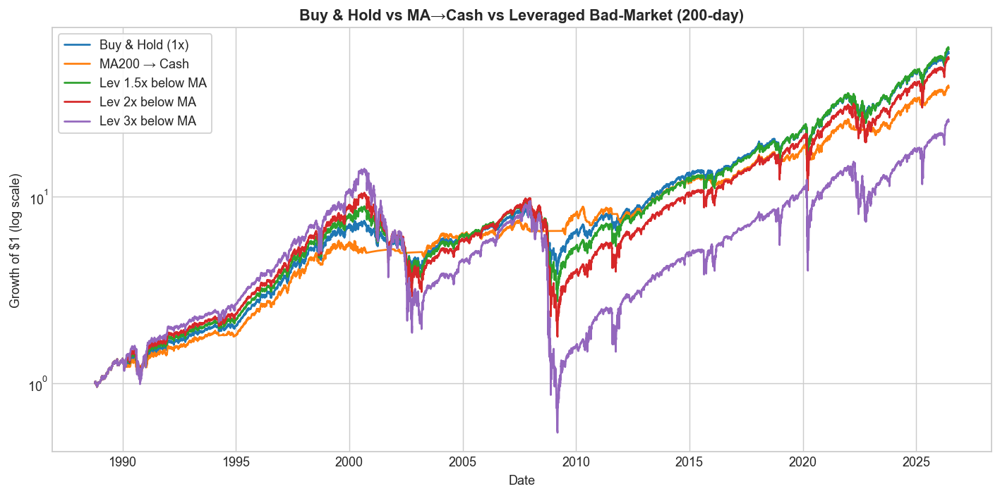
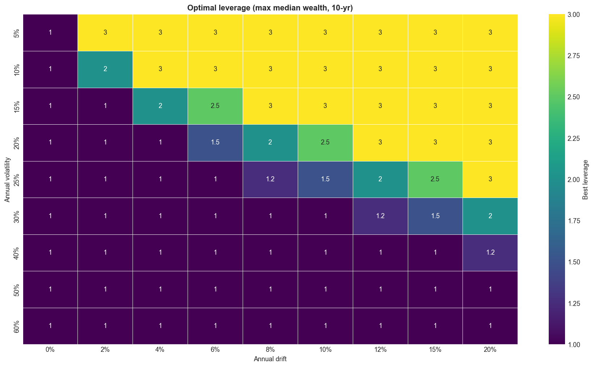
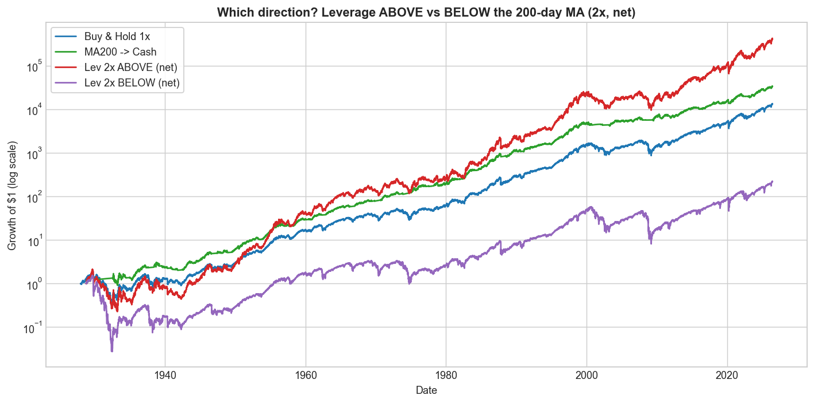
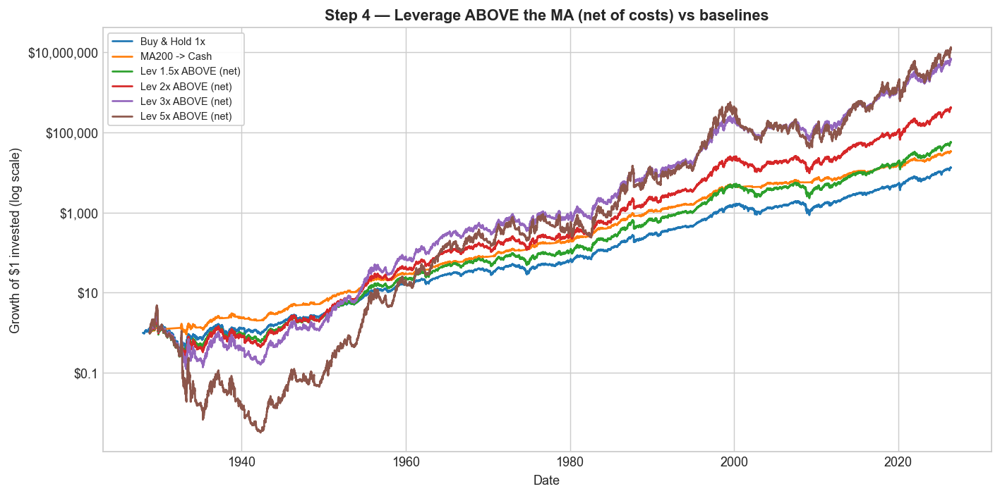
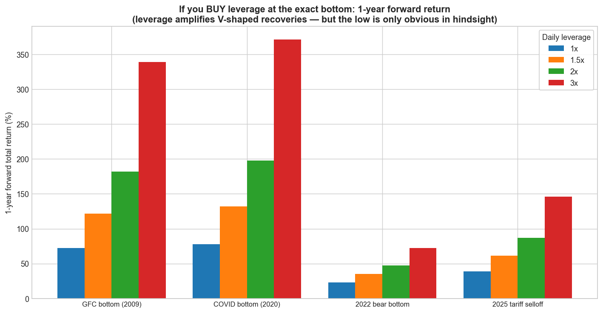
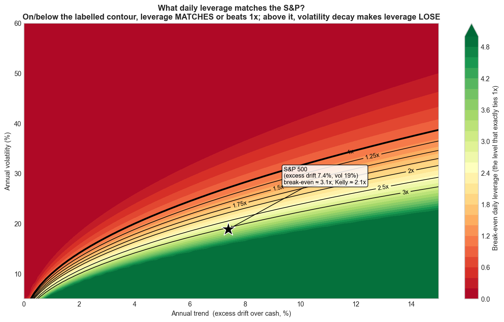
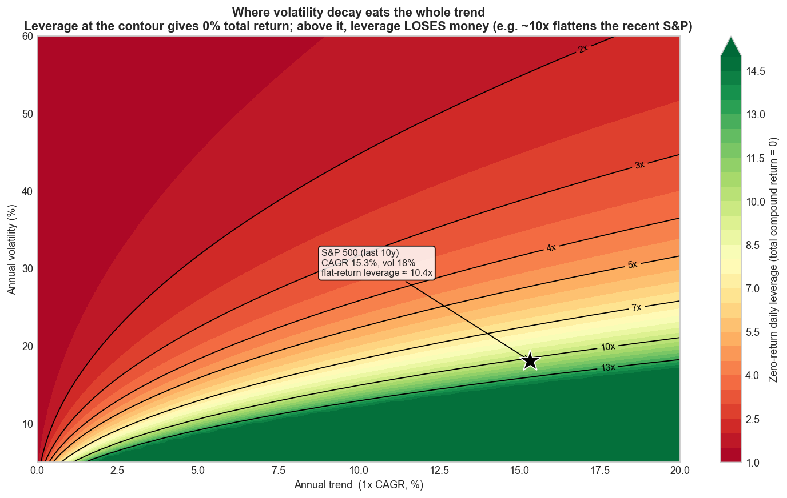

# Trend Following, Leveraged Re-Entry, and Volatility Decay

### Can daily leveraged S&P 500 exposure improve long-term returns?

A small, readable, **reproducible** quantitative-research project that honestly
tests a tempting idea — and finds that it does not work. Built from scratch in
Python (no black-box backtesting frameworks) so a beginner can read the code and
the paper from start to finish.

> ⚠️ **Educational research only — not investment advice.** Leveraged ETFs are
> high-risk and can lose most of their value.

---

## The hypothesis

The classic **Faber trend rule** holds the S&P 500 when it is above its long
moving average and **moves to cash** when it falls below. This project tests a
twist:

> **When the S&P 500 is *below* its moving average, hold *daily-leveraged* S&P 500
> instead of cash** — on the theory that bad markets are followed by strong
> rebounds that leverage could amplify.

| | Above the moving average | Below the moving average |
|---|---|---|
| Buy & Hold | 1× | 1× |
| MA → Cash (Faber) | 1× | cash (T-bills) |
| **This project** | **1×** | **L× daily leverage** (L = 1.25 … 3.0) |

We test leverage **1.0, 1.25, 1.5, 2.0, 2.5, 3.0×** and moving-average windows of
**50, 100, 150, 200, 210, 250, 252 days**, gross and net of realistic costs — and
we do **not** assume it works.

## Results at a glance

S&P 500 total return, 1988–2026 (38 years), gross of costs:

| Strategy | CAGR | Volatility | Sharpe | Max drawdown | Calmar |
|---|---|---|---|---|---|
| Buy & Hold (1×) | 11.5% | 17.9% | 0.54 | −55% | 0.21 |
| **MA200 → Cash** (Faber) | 10.2% | 11.8% | **0.64** | **−21%** | **0.50** |
| Lev 1.5× below MA | 11.6% | 23.4% | 0.47 | −71% | 0.16 |
| Lev 2× below MA | 11.2% | 29.4% | 0.41 | −83% | 0.14 |
| Lev 3× below MA | 9.0% | 42.0% | 0.35 | −96% | 0.09 |

* **0 of 35** genuinely-leveraged configurations beat buy-and-hold on all of
  CAGR / Sharpe / Calmar / drawdown — and **0** beat it on Sharpe — gross *or*
  net of costs.
* Leverage barely changes CAGR but **massively deepens drawdowns** and **lowers
  Sharpe**.
* The **original move-to-cash rule is the risk-adjusted winner.**

**Why?** Daily leverage suffers **volatility decay** (≈ ½·L²·σ² per year). The
strategy leverages *below-trend* markets — the **highest-volatility** regimes —
so it applies leverage exactly where the math says not to.

<p align="center">

</p>

The 3× line leads into 2000, then collapses ~96% in the 2008 bear and never
recovers its lead. A 10,000-path Monte Carlo shows leverage only pays in
**low-volatility, positive-drift** markets:

<p align="center">

</p>

(Optimal leverage is high only in the top-right — low vol, high drift. Below-trend
"bad markets" live in the high-vol bottom rows, where the optimum is **1×**.)

## Part II — following Faber faithfully, and fixing the direction

Part II (run `python run_faber_leverage.py`) does the analysis Faber's way —
**monthly, 10-month SMA, total return back to 1901** (replicating his published
−83.7%→−42.2% drawdown reduction to within a point) — and tests the **inverted**
rule on daily data back to **1928**: *leverage above the trend, 1× below.*

**Which direction? Full history — 1928–2026, net of costs.** "Buy leverage low"
(below the MA) vs "leverage the uptrend" (above the MA), at every level:

| Strategy | CAGR | Sharpe | Sortino | Max DD | Calmar |
|---|---|---|---|---|---|
| Buy & Hold 1× | 10.1% | 0.40 | 0.56 | −84% | 0.12 |
| MA200 → Cash | 11.3% | **0.60** | **0.84** | **−46%** | **0.24** |
| Lev 1.5× **ABOVE** | 11.9% | 0.43 | 0.60 | −86% | 0.14 |
| Lev 2× **ABOVE** | 14.2% | 0.47 | 0.66 | −89% | 0.16 |
| Lev 3× **ABOVE** | **17.5%** | 0.50 | 0.71 | −96% | 0.18 |
| Lev 1.5× *BELOW* | 7.9% | 0.27 | 0.38 | −94% | 0.08 |
| Lev 2× *BELOW* | 5.7% | 0.21 | 0.29 | −98% | 0.06 |
| Lev 3× *BELOW* | −0.2% | 0.13 | 0.19 | −100% | −0.00 |

The intuitive **"buy leverage low"** (below the MA) gets *worse* with leverage and
3× actually loses money — because the 200-day MA flags "below trend" at the
*start* of declines (high-volatility, still-falling), not at the bottom.
**Leveraging the uptrend (above the MA)** gets *better* with leverage. Same idea,
opposite direction, ~2000× difference in terminal wealth:

<p align="center">

</p>

**Closer look — 2000–2026 only** (excludes 1929/1987, so drawdowns are more
survivable):

| Strategy | CAGR | Sharpe | Max DD | Calmar |
|---|---|---|---|---|
| Buy & Hold 1× | 8.3% | 0.41 | −55% | 0.15 |
| MA200 → Cash | 7.5% | **0.52** | **−21%** | **0.36** |
| Lev 1.5× ABOVE MA | 9.5% | 0.43 | −59% | 0.16 |
| Lev 2× ABOVE MA | 11.1% | 0.45 | −63% | 0.18 |
| Lev 3× ABOVE MA | 13.4% | 0.47 | −74% | 0.18 |
| Lev 2× BELOW MA *(Part I)* | 5.7% | 0.28 | −86% | 0.07 |

**Inverting the rule roughly doubles the Sharpe and triples the CAGR** vs
leveraging below trend, and beats buy-and-hold on CAGR/Sharpe/Calmar in both
windows — but it always has deeper drawdowns than buy-and-hold and never beats
plain move-to-cash on risk-adjusted terms. (Post-2000 the drawdowns are far more
survivable: 3× peaks at −74% rather than −96%.) The closed-form/Monte-Carlo
growth-optimum for the S&P is **Kelly ≈ 2×** (break-even ≈ 3.1×).

<p align="center">

</p>

**Leverage works if you time it.** Buying leverage at the *exact* market bottom is
spectacular — 1-year forward total return of **+339% (3×) off the GFC low** and
**+372% off the COVID low** — the problem is the low is only obvious in hindsight,
and the MA's "below-trend" signal fires at the *start* of declines, not the bottom.

<p align="center">

</p>

**How much leverage is "too much"?** Two maps over trend × volatility. The
**break-even** map shows the leverage that exactly *ties* 1× (S&P ★ ≈ 3.1×); the
**zero-return** map shows the leverage at which volatility decay cancels the trend
entirely (total return = 0). For the recent S&P (CAGR ~15%, vol ~18%) that flat
point is **≈ 10×** — a "10× S&P" fund would have gone nowhere.

<p align="center">


</p>

**Net takeaway:** trend-following is fundamentally a *risk-reducer*; *if* you add
leverage, add it modestly (~1.5–2×) **above** the trend, never below it. Long data
back to 1928 is real `^SP500TR` (1988+) spliced with a Shiller-dividend
reconstruction (validated at 0.5%/yr tracking error vs the real series).

## Repository layout

```
README.md                  ← you are here
requirements.txt
run_all.py                 ← Part I: regenerates results + charts
run_faber_leverage.py      ← Part II: Faber replication + inverted strategy
build_notebooks.py         ← regenerates the 9 notebooks from source
build_pdf.py               ← optional: rebuild the paper PDF
data/
  raw/                     ← cached Yahoo Finance downloads (one CSV per ticker)
src/
  config.py                ← all paths, tickers, parameters, cost assumptions
  data_loader.py           ← download + cache (with offline synthetic fallback)
  data_cleaning.py         ← clean/align series + data-summary table
  returns.py               ← prices → returns → cumulative index
  signals.py               ← moving-average trend signal (lagged)
  long_history.py          ← long total return: Shiller (1871+) + daily reconstruction
  backtest.py              ← from-scratch daily backtester (incl. leverage above/below MA)
  metrics.py               ← CAGR, vol, Sharpe, Sortino, drawdown, Calmar, ...
  sweep.py                 ← parameter sweep + period/episode analysis
  plots.py                 ← all charts
  monte_carlo.py           ← volatility-decay / optimal-leverage simulations
  etf_tests.py             ← synthetic leverage vs real leveraged ETFs
notebooks/                 ← 01…09, runnable in order, beginner → advanced
charts/                    ← all figures (.png)
results/                   ← all result tables (.csv) + headline_results.json
reports/
  research_paper.md        ← the full 20-section study
  executive_summary.md     ← one-page summary
```

## Install

```bash
git clone <this-repo>
cd leveraged-trend-following
python -m venv .venv && source .venv/bin/activate   # Windows: .venv\Scripts\activate
pip install -r requirements.txt
```

Requires Python 3.10+.

## Run the analysis

```bash
# Reproduce every table (results/) and chart (charts/) and the headline JSON.
# Uses cached data in data/raw; downloads from Yahoo Finance on first run.
python run_all.py

# Quicker run with a smaller Monte Carlo grid:
python run_all.py --fast
# Or set the number of Monte Carlo paths explicitly:
python run_all.py --mc-paths 10000

# Part II: Faber replication (monthly, 1901+) + the inverted leverage-above-MA
# strategy on daily data back to 1928. Downloads the Shiller spreadsheet once.
python run_faber_leverage.py
```

## Reproduce the charts / notebooks

* Charts are written to `charts/` by `python run_all.py`.
* Run the test suite with `python -m pytest tests/ -q` (11 fast sanity tests
  covering volatility-decay arithmetic, the no-look-ahead lag, the Sortino/metric
  formulas, and the monthly-signal one-month lag).
* Rebuild the PDF (optional, needs `pip install markdown-pdf pymupdf`):
  `python build_pdf.py`.
* The eight teaching notebooks are generated by `python build_notebooks.py` and
  are designed to be read **in order**:

| Notebook | Topic |
|---|---|
| 01 | Load & clean the S&P 500 total-return data |
| 02 | Buy-and-hold baseline and how every metric is defined |
| 03 | Moving-average timing (the Faber move-to-cash rule) |
| 04 | The leveraged bad-market strategy |
| 05 | Parameter sweep + heatmaps (no cherry-picking) |
| 06 | Real leveraged-ETF reality check (SSO / UPRO / SPXL) |
| 07 | Monte Carlo & volatility decay |
| 08 | Final results & verdict (Part I) |
| 09 | Faber replication + the inverted (leverage-above-trend) strategy (Part II) |

## Data

* **Primary:** `^SP500TR` — true daily S&P 500 **total return** (1988+).
* **Long-history context:** `^GSPC` price index (1927+, dividends excluded).
* **Risk-free / financing:** `^IRX` 13-week T-bill (1960+).
* **Real leveraged ETFs:** SSO (2×), UPRO (3×), SPXL (3×); 1× proxies SPY/IVV/SPLG/VOO.

All from Yahoo Finance via `yfinance`, cached locally. New tickers can be added by
editing one dictionary in `src/config.py`. If you are offline, the loader falls
back to a clearly-labelled synthetic series so the pipeline still runs (no results
in the paper use it). Full provenance: `results/data_summary.csv`.

## Key limitations

* True daily *total-return* data starts in 1988 (one ~38-year sample).
* Leveraged ETFs are young (2006–2009) and born into a bull market.
* Monte Carlo uses constant drift/vol with i.i.d. (optionally fat-tailed) shocks;
  real volatility clustering makes leverage in bad regimes *worse*, not better.
* US-centric single index; no taxes.

See [`reports/research_paper.md`](reports/research_paper.md) §19 for the full list.

## What I'd build next

The result inverts the hypothesis: **leverage belongs in calm uptrends, not
volatile downtrends.** Natural follow-ups: leverage *above* the MA / de-risk
below it; **volatility targeting** (`target_vol / realized_vol`); multi-timeframe
trend signals; longer and international histories.

---

*Built as an educational, reproducible research project. Not investment advice.*
