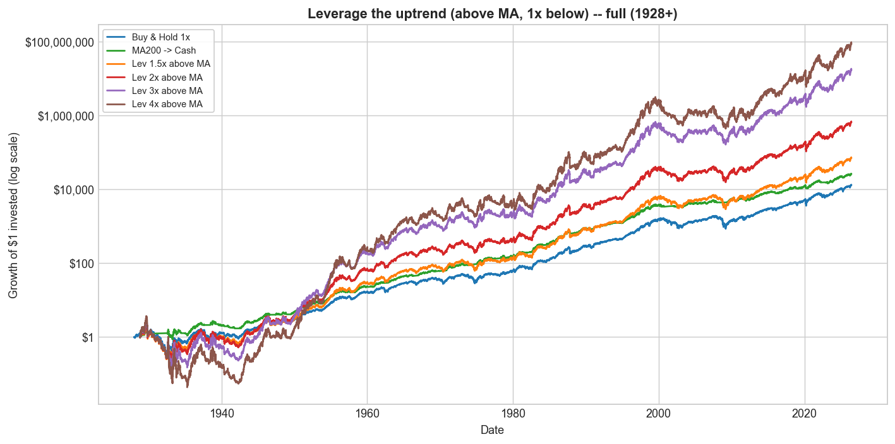

# Trend Following, Leveraged Re-Entry, and Volatility Decay

### Can daily-leveraged S&P 500 exposure improve long-term returns?

A small, readable, **reproducible** quantitative-research project, built from
scratch in Python (no black-box backtesting frameworks). It tests one trend
signal — the **200-day moving average** (the daily twin of Mebane Faber's 10-month
rule) — on S&P 500 **total return** back to 1928, then asks what happens when you
switch leverage on and off with it.

> ⚠️ **Educational research only — not investment advice.** Leveraged ETFs are
> high-risk instruments that can lose most of their value.

---

## 📄 Start here

| Document | What it is |
|---|---|
| **[`reports/executive_summary.md`](reports/executive_summary.md)** | One page — the question, the headline, the verdict. |
| **[`reports/research_paper.md`](reports/research_paper.md)** | The full study (8 sections, every per-horizon table, all charts). PDF: `reports/research_paper.pdf`. |
| Notebooks `notebooks/01…09` | Read in order, beginner → advanced. |

---

## The headline: it depends on the yardstick

Full history (1928–2026, net of costs). "Above MA" = hold L× leverage while the
S&P is above its 200-day average, plain 1× below.

| Strategy | Grew $1 to | CAGR | Sharpe | **IR vs S&P** | Max DD |
|---|---|---|---|---|---|
| Buy & Hold 1× (S&P) | $13,021 | 10.1% | 0.43 | — | −84% |
| **MA200 → Cash** (Faber) | $25,922 | 11.0% | **0.63** | ~0.00 | **−46%** |
| Lev 2× above MA | $655,939 | 14.8% | 0.51 | 0.53 | −89% |
| **Lev 4× above MA** | **$87,028,073** | **20.7%** | 0.56 | **0.57** | −99% |

<p align="center"></p>

**Three benchmarks, three winners:**

* **On Sharpe, the plain move-to-cash rule is hard to beat** (0.63 vs the S&P's
  0.43) — the best *risk-adjusted* strategy in the study.
* **On information ratio it is easily beaten.** Move-to-cash has a ~zero (recently
  *negative*) IR vs the S&P — as a bet against the index it has *lagged* the bull.
  **Leveraging the uptrend** posts a large positive IR (0.47 → 0.57) *and* a higher
  Sharpe than the index — so it beats buy-and-hold on nearly every measure except
  drawdown.
* **Direction and the filter are everything.** Leverage the *downtrend* ("buy the
  dip") and 3× turns $1 into **$0.79**; hold 4× *constantly* and $1 becomes **$54**
  over a century — but 4× *switched by the MA* becomes **$87 million**. The trend
  filter, not the leverage, is what pays.

The full breakdown — leverage→cash and 3-tier variants, the last 50 / 30 / 15-year
tables, crisis-low event studies, the volatility-decay maps, and the real
leveraged-ETF reality check — is in the [research paper](reports/research_paper.md).

---

## Install

```bash
git clone https://github.com/Taff1887/leveraged-trend-following
cd leveraged-trend-following
python -m venv .venv && source .venv/bin/activate   # Windows: .venv\Scripts\activate
pip install -r requirements.txt          # Python 3.10+
```

## Run

```bash
# The main study (this README + research_paper.md): Faber replication, the
# leverage-the-uptrend strategy and variants, volatility-decay maps, event studies,
# per-horizon breakdowns. Downloads + caches the data on first run.
python run_faber_leverage.py

# Supplementary: a broad sweep (50–252-day MAs, costs, periods), a 10,000-path
# Monte Carlo, and a real leveraged-ETF reality check (SSO/UPRO/SPXL).
python run_all.py            # add --fast for a quicker Monte Carlo

python build_notebooks.py    # rebuild the 9 teaching notebooks
python -m pytest tests/ -q   # 11 sanity tests (vol-decay, no look-ahead, metrics)
python build_pdf.py          # optional: rebuild the PDF (pip install markdown-pdf pymupdf)
```

## Repository layout

```
README.md
reports/
  executive_summary.md    ← one-page summary (start here)
  research_paper.md        ← the full study (+ research_paper.pdf)
run_faber_leverage.py      ← the main study
run_all.py                 ← supplementary sweep + Monte Carlo + ETF tests
build_notebooks.py / build_pdf.py
src/
  config.py               ← paths, tickers, parameters, cost assumptions
  data_loader.py          ← Yahoo download + cache
  long_history.py         ← long total return (Shiller) + real-T-bill (Ken French) splice
  data_cleaning.py  returns.py  signals.py
  backtest.py             ← from-scratch daily backtester (leverage above/below MA, →cash, 3-tier)
  metrics.py              ← CAGR, vol, Sharpe, Sortino, Calmar, max drawdown, information ratio
  monte_carlo.py  sweep.py  plots.py  etf_tests.py
notebooks/   charts/   results/   tests/
```

## Data — all real

Every return and cash rate is **real, physical** market data:

* **Total return** — real `^SP500TR` (1988+); before that, real `^GSPC` price + real
  Shiller dividends (a reconstruction from real components, validated at 0.5%/yr vs
  the real series). The pipeline refuses to run on the synthetic offline fallback.
* **T-bill / cash** — real `^IRX` (1960+) and the real Ken French / Ibbotson 1-month
  bill (1926+). The only span with no free real short-rate (1901–1926, used only by
  the monthly replication) uses the **average of the real series**, not a constant.
* The one explicit *model* (not data) is the cost set (expense, financing spread,
  turnover); every result is also reported gross. Sources cached in `data/raw`.

## Limitations

* True daily *total-return* data begins in 1988; pre-1988 is a validated
  reconstruction. Leveraged ETFs are young (2006–2009).
* Leveraging the uptrend has **deep drawdowns** (−86% to −99%) and does not beat
  move-to-cash on Sharpe. Monte Carlo uses i.i.d. shocks; real volatility clustering
  punishes leverage more. US-only, single index, no taxes.

See [`reports/research_paper.md`](reports/research_paper.md) for the full limitations.

## What I'd build next

**Volatility targeting** (scale leverage by `target_vol / realized_vol`) to tame the
deep drawdowns; a threshold-based "large down move" cash trigger; multi-timeframe
signals; international and longer histories.

---

*Built as an educational, reproducible research project. Not investment advice.*
