# Trend Following, Leveraged Re-Entry, and Volatility Decay

### Can Daily Leveraged S&P 500 Exposure Improve Long-Term Returns?

*A reproducible, beginner-friendly research study.*
*Sample: S&P 500 Total Return, 4 January 1988 – 8 June 2026 (38.4 years of daily data).*

> **Disclaimer.** This is an educational research project, not investment advice.
> Past performance — real or simulated — does not predict future results.
> Leveraged ETFs are risky instruments that can lose most of their value.

---

## 1. Abstract

The classic Faber-style trend rule holds a stock index when it is above its
long moving average and moves to cash when it falls below. This paper tests a
deliberately aggressive twist: **instead of de-risking into cash during
below-trend ("bad") markets, rotate into *daily-leveraged* S&P 500 exposure**,
on the theory that weak markets are disproportionately followed by strong
rebounds that leverage could amplify.

Using 38 years of true daily S&P 500 *total-return* data, a from-scratch daily
backtester, a parameter sweep over seven moving-average windows and six leverage
levels, a real leveraged-ETF reality check (SSO, UPRO, SPXL), and a 10,000-path
Monte Carlo study of volatility decay, we find:

* **The hypothesis is rejected on a risk-adjusted basis.** Out of 35 genuinely
  leveraged configurations, **zero** beat simple buy-and-hold on all of CAGR,
  Sharpe, Calmar, and maximum drawdown — gross *or* net of costs. **Zero** beat
  buy-and-hold on Sharpe at all.
* Low leverage (1.25–1.5×) can nudge the **compound growth rate** up by a few
  tenths of a percent, but always at a **disproportionately** larger drawdown
  (the 2× rule's worst loss is −83% versus buy-and-hold's −55%; the 3× rule's is
  −96%).
* The original **move-to-cash** rule is the clear risk-adjusted winner (Sharpe
  0.64 vs 0.54 for buy-and-hold, max drawdown −21% vs −55%). Adding leverage
  moves you in exactly the wrong direction.
* Monte Carlo explains *why*: leverage only pays in **low-volatility,
  positive-drift** regimes. Below-trend markets are the **high-volatility**
  regimes, where **volatility decay** (a penalty that grows with the *square* of
  leverage) destroys leveraged wealth. The strategy applies leverage precisely
  where the mathematics says it should not.
* The one place leverage helped historically was the **post-2009 era of shallow,
  V-shaped dips** (and the 2020 COVID crash specifically) — a regime, not a law.

**Bottom line: a clever-sounding idea that fails an honest test.** It is a
textbook case of confusing "more return in good times" with "a better
strategy."

**Part II** then follows Faber's *actual* method (monthly, 10-month SMA, total
return back to 1901 — replicated to within a point of his published drawdowns)
and tests the **inverted** rule on data back to 1928: leverage *above* the trend,
1× below. That inversion is a genuine improvement — at 2× it roughly **doubles
the Sharpe and triples the CAGR** of the leverage-below rule and beats
buy-and-hold on CAGR, Sharpe, and Calmar — though it still suffers deeper maximum
drawdowns than buy-and-hold, and never beats simple move-to-cash on risk-adjusted
terms. The lesson: *if* you leverage, leverage the calm uptrend, not the volatile
downtrend.

---

## 2. Introduction

Two of the most durable ideas in practitioner finance are in tension here.

1. **Trend-following works as a risk-reducer.** Simple moving-average rules have
   historically cut drawdowns sharply while keeping most of the upside. Mebane
   Faber's *A Quantitative Approach to Tactical Asset Allocation* (2007) made the
   10-month / ~200-day version famous.
2. **Leverage is a double-edged sword.** Daily-rebalanced leverage (the kind
   sold in ETFs like SSO and UPRO) multiplies *daily* returns, and compounding
   those daily multiples introduces **volatility decay** — a structural drag that
   can turn a flat market into a loss.

This project asks what happens when you point leverage at the *weak* part of the
market instead of de-risking. If bad markets really are "coiled springs," daily
leverage during them might capture outsized rebounds. If they are instead the
high-volatility, slow-bleeding declines that history actually delivers, leverage
will compound the losses and dig a hole that is mathematically hard to climb out
of. We let 38 years of data and a Monte Carlo laboratory decide.

We build everything from the ground up — data loading, cleaning, returns,
signals, backtest, metrics — so a reader new to quantitative finance can follow
every step and re-run every number.

---

## 3. Motivation

The emotional appeal of the idea is obvious: *"buy more when it's cheap."*
After a market falls 20–30%, expected forward returns are usually higher, so
adding exposure feels smart. Leverage seems like the natural way to "add
exposure."

But there are two hidden problems that the headline intuition skips:

1. **"Below the moving average" is not the same as "cheap."** It is a *trend*
   signal, and trends that have just broken to the downside are, empirically, the
   most volatile periods in the market. Volatility is the enemy of leverage.
2. **Daily leverage is not the same as borrowing once and holding.** A 2× ETF
   does not give you 2× the *period* return; it gives you 2× the *daily* return,
   rebalanced every day. Over choppy paths the two diverge badly, and the
   divergence is always against the leveraged holder.

The motivation of this paper is to test the appealing story against these two
inconvenient facts, honestly and reproducibly.

---

## 4. Background: moving-average timing and Faber-style tactical allocation

A **simple moving average (SMA)** of window *N* is just the average closing
level over the last *N* trading days:

$$\text{SMA}_N(t) = \frac{1}{N}\sum_{i=0}^{N-1} P_{t-i}.$$

The Faber-style rule defines a binary **trend signal**:

$$
\text{signal}(t) =
\begin{cases}
1 & \text{if } P_t > \text{SMA}_N(t) \quad(\text{"above trend" / risk-on})\\
0 & \text{if } P_t \le \text{SMA}_N(t) \quad(\text{"below trend" / risk-off})
\end{cases}
$$

* **Classic rule:** signal 1 → hold the index; signal 0 → hold cash/T-bills.
* The original is monthly with a 10-month average; on daily data the rough
  equivalents are **200–252 days**.

The empirical appeal is well known and we reproduce it below: similar long-run
returns to buy-and-hold, with far lower volatility and much shallower drawdowns,
because the rule sidesteps the worst of sustained bear markets.

**Avoiding look-ahead bias.** You can only act on what you knew *yesterday*. So
the position held on day *t* is set by the signal computed at the **close of day
*t−1***. Throughout, we lag the signal by one day:

$$\text{position}(t) = \text{signal}(t-1).$$

---

## 5. Why leveraged ETFs are different

A daily leveraged fund targets a constant multiple **L** of the index's *daily*
return:

$$r^{\text{lev}}_t = L \cdot r^{\text{index}}_t \quad(\text{before fees/financing}).$$

Because returns **compound daily**, the multi-day outcome is *not* `L ×` the
index's multi-day outcome. The classic two-day example (used in Part 7):

| Move | 1× | 2× | 3× |
|---|---|---|---|
| Day 1: index +10% | +10% | +20% | +30% |
| Day 2: index −10% | −10% | −20% | −30% |
| **Two-day result** | **−1.0%** | **−4.0%** | **−9.0%** |

The index round-trips to −1%; the 2× loses 4%; the 3× loses 9%. The market went
essentially nowhere, yet leverage lost money — and **the loss grows with the
square of leverage**. This is **volatility decay** (a.k.a. *beta slippage* or
*variance drag*). For a diffusion with annual volatility σ, the approximate
annual growth penalty from leverage L is

$$\text{variance drag} \approx \tfrac{1}{2}\,L^2\,\sigma^2.$$

At 20% volatility that is ≈2%/yr for 1×, **8%/yr for 2×, and 18%/yr for 3×.**
Real ETFs add ~0.9% expense and financing cost on the borrowed portion on top.
Section 13 shows the real ETFs (SSO, UPRO, SPXL) behave almost exactly like our
synthetic leverage, confirming these mechanics are not a modelling artefact.

---

## 6. Data

| Series | Ticker | Role | History | Kind |
|---|---|---|---|---|
| S&P 500 Total Return | `^SP500TR` | **Primary underlying** | 1988-01-04 → 2026-06-08 (9,680 daily obs → 9,679 returns) | True daily total return |
| SPDR S&P 500 ETF | `SPY` | 1× proxy | 1993+ | Adjusted close = total return |
| S&P 500 price index | `^GSPC` | Long-history context | 1927+ (24,725 days) | **Price only — no dividends** |
| 13-week T-bill rate | `^IRX` | Risk-free / financing | 1960+ | Annualized rate (%) |
| ProShares Ultra S&P500 | `SSO` | Real 2× ETF | 2006-06-21+ | Adjusted close |
| Direxion Daily Bull 3X | `SPXL` | Real 3× ETF | 2008-11-05+ | Adjusted close |
| ProShares UltraPro | `UPRO` | Real 3× ETF | 2009-06-25+ | Adjusted close |
| IVV / SPLG / VOO | — | 1× proxies | 2000 / 2009 / 2010+ | Adjusted close |

All data is from **Yahoo Finance** via `yfinance`, cached locally in `data/raw`
so results are reproducible without re-downloading. The full machine-readable
table is `results/data_summary.csv`.

**Data choices and their limitations (stated plainly):**

1. **Primary series is `^SP500TR`** — a *true daily total-return* index
   (dividends reinvested). This is the right object to study because it is what a
   buy-and-hold investor actually earns.
2. **True daily total return only begins in 1988** on free sources. Earlier daily
   *price* history exists (`^GSPC`, 1927+) but excludes dividends. We therefore:
   * run the headline analysis on the 1988+ total-return data, and
   * use the price-only `^GSPC` **only** for the long-history *episode* stress
     tests (Section 12), clearly labelled "price only."
3. Because total-return data starts in 1988, the "1950 / 1970 / 1980 onward"
   period cuts collapse onto the full sample — we report them but they are
   identical, and we say so.
4. **Leveraged ETFs are young** (2006–2009) and were born into a favourable
   post-crisis bull market, so their real-money record is short and
   period-biased. We use them as a *reality check* on synthetic leverage, not as
   a long-history backtest.
5. We do **not** use any private or obscure dataset. If you are offline, the code
   falls back to a clearly-labelled synthetic series so the pipeline still runs;
   none of the results in this paper use synthetic data.

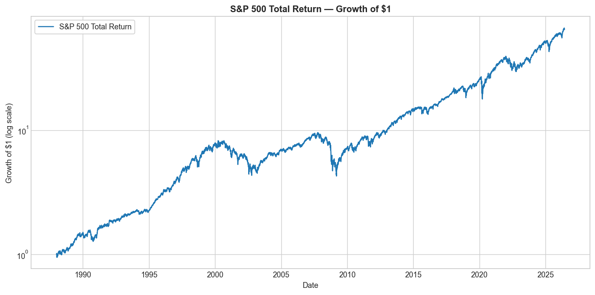

---

## 7. Data cleaning

Cleaning is conservative and fully reported (`src/data_cleaning.py`). For each
series we:

* **sort** by date and **drop duplicate** dates (keep the last print);
* **trim** leading/trailing missing values;
* **forward-fill only short interior gaps** (≤ 3 days), because a one- or two-day
  stale price barely affects daily returns; we never fill long outages;
* **detect missing trading days** by comparing to a business-day calendar and
  record the count;
* compute **daily simple returns** $r_t = P_t/P_{t-1} - 1$ and the **cumulative
  index** $W_t = \prod_{i\le t}(1+r_i)$.

The S&P 500 total-return series required essentially no repair (no duplicates, no
interior fills). The cleaning report for every series, including missing-day
counts and the total-return/adjusted/price-only label, is in
`results/data_summary.csv`.

---

## 8. Methodology

We implement one small, transparent daily backtester (`src/backtest.py`). Every
strategy is expressed as a daily **exposure** schedule `e[t]` to the index:

* `e = 1.0` → fully invested in 1× S&P 500;
* `e = 0.0` → in cash (earns the daily T-bill rate);
* `e = L > 1` → daily L× leveraged exposure (borrow `L − 1` units).

The **net daily return** is the money equation:

$$
\underbrace{e_t\, r_t}_{\text{market}}
+ \underbrace{\max(1-e_t,0)\,\text{rf}_t}_{\text{cash on idle capital}}
- \underbrace{\max(e_t-1,0)\,(\text{rf}_t+\text{spread})}_{\text{financing}}
- \underbrace{\text{expense}_t}_{\text{fund fee}}
- \underbrace{c\,|e_t-e_{t-1}|}_{\text{trading cost}}
$$

then compounded daily into an equity curve. Because we compound the *leveraged
daily* returns, **volatility decay is captured automatically** — we never model
it as a separate term; it simply emerges.

**The three strategies:**

| Strategy | Above MA | Below MA |
|---|---|---|
| Buy & Hold | 1× | 1× |
| MA → Cash (Faber) | 1× | cash (T-bill) |
| **Leveraged bad-market (this paper)** | **1×** | **L× (L = 1.25 … 3.0)** |

**Look-ahead control:** the signal is lagged one day everywhere.

**Costs** (Section 17): every result is run **gross (0 cost)** first, then with a
realistic set — 0.09%/yr expense on the 1× sleeve, 0.95%/yr on the leveraged
sleeve, financing at T-bill + 0.50%, and 5 bps per unit of exposure traded.

**Metrics** (`src/metrics.py`): CAGR, annualized volatility, Sharpe (excess of
the 13-week T-bill), Sortino, maximum drawdown, Calmar (CAGR ÷ |max DD|), plus
best/worst day and month and % positive days/months.

---

## 9. Buy-and-hold baseline

Holding the S&P 500 total-return index from 1988 to 2026:

| Metric | Value |
|---|---|
| Total return | **63.7×** (i.e. $1 → ~$65) |
| CAGR | **11.47%** |
| Annualized volatility | 17.87% |
| Sharpe (vs T-bill) | 0.54 |
| Sortino | 0.76 |
| **Maximum drawdown** | **−55.3%** |
| Calmar | 0.21 |
| Worst day / best day | −11.98% / +11.58% |
| Worst month / best month | −16.8% / +12.8% |
| % positive days / months | 54.5% / 66.0% |

Buy-and-hold compounds beautifully, but it lived through a **−55% drawdown** (the
2007–09 crisis) that took years to recover. That pain is the target every
"improvement" in this paper is trying to beat.

---

## 10. Moving-average-to-cash baseline

Replicating the Faber rule across windows (gross of costs, cash earns the
T-bill; full table in `results/part2_ma_timing_metrics.csv`). The canonical
**200-day** version:

| Metric | Buy & Hold | **MA200 → Cash** |
|---|---|---|
| CAGR | 11.47% | 10.17% |
| Volatility | 17.87% | **11.76%** |
| Sharpe | 0.54 | **0.64** |
| Max drawdown | −55.3% | **−20.6%** |
| Calmar | 0.21 | **0.50** |
| Switches | 0 | 224 |

This is the well-known result: the trend rule gives up ~1.3%/yr of CAGR but cuts
volatility by a third, **more than halves the drawdown**, and lifts Sharpe and
Calmar substantially. **The classic rule is a genuine risk-adjusted improvement.**
This is the bar the leveraged variant must clear.

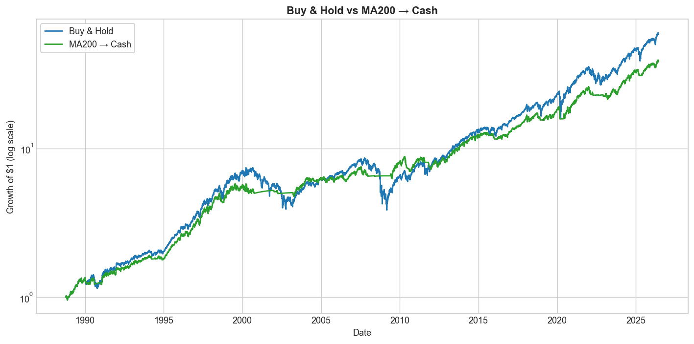
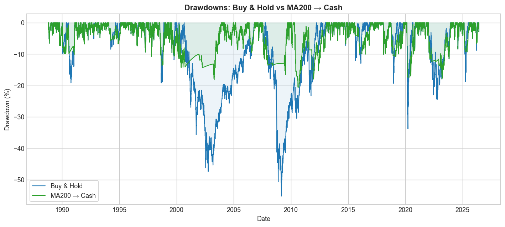

The signal chart below shades the below-trend periods — the windows in which our
leveraged strategy switches on extra exposure:

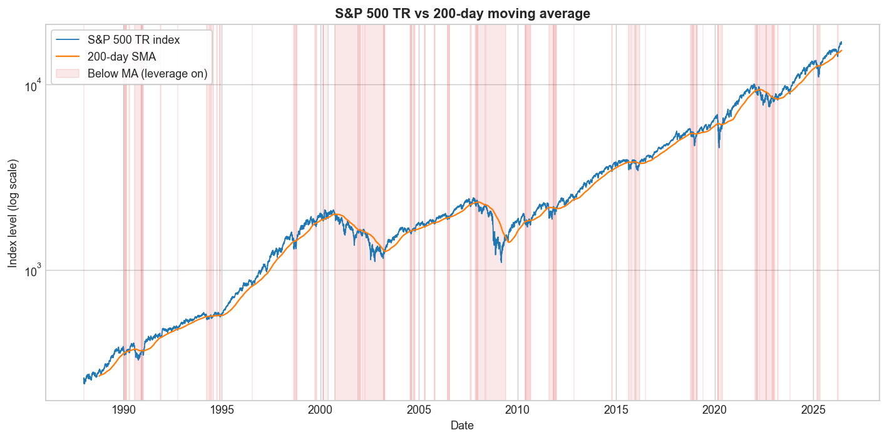

---

## 11. The leveraged bad-market strategy

Now the central experiment: above the 200-day MA hold 1×; **below it hold L×**.
Gross of costs (full table `results/part3_leveraged_200d_metrics.csv`):

| Leverage below MA | CAGR | Volatility | Sharpe | Max drawdown | Calmar |
|---|---|---|---|---|---|
| 1.00× (= buy & hold) | 11.4% | 17.9% | 0.54 | −55% | 0.21 |
| 1.25× | 11.6% | 20.5% | 0.50 | −64% | 0.18 |
| 1.50× | **11.6%** | 23.4% | 0.47 | −71% | 0.16 |
| 2.00× | 11.2% | 29.4% | 0.41 | −83% | 0.14 |
| 2.50× | 10.3% | 35.6% | 0.38 | −92% | 0.11 |
| 3.00× | **9.0%** | 42.0% | 0.35 | **−96%** | 0.09 |

Read this table slowly, because it is the heart of the paper:

* CAGR **barely moves** from 1× to 1.5× (+0.1–0.2%), then **falls** as leverage
  rises further. By 3× the compound return is *below* buy-and-hold despite far
  more risk.
* Every step of leverage makes the **drawdown dramatically worse** (−55% → −96%)
  and the **Sharpe ratio steadily lower** (0.54 → 0.35).
* There is no leverage level at which you are being *paid* for the extra risk.


The equity chart tells the story visually: the 3× line (purple) leads into 2000,
then the 2000–02 and 2008–09 bear markets — exactly when the strategy is
leveraged — send it down ~96% and **it never leads again**. Leverage applied to a
*sustained* decline compounds the losses; the hoped-for rebound arrives too late
and from too low a base.

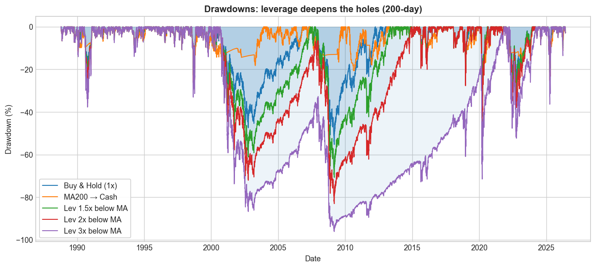

For contrast, `charts/03_always_leveraged.png` shows *constant* daily leverage on
the index (the naive "just hold 3×" bet), which is even worse — a pure
demonstration of volatility decay.

---

## 12. Parameter sweep

To rule out cherry-picking, we sweep **all** combinations of {7 MA windows} ×
{6 leverage levels} × {gross, net} costs (`results/part4_parameter_sweep.csv`),
and ask the blunt question: **does any genuinely-leveraged config (>1×) beat
buy-and-hold on every metric at once?**

| Scoreboard (out of 35 leveraged configs) | Gross | Net of costs |
|---|---|---|
| Beat buy-and-hold on CAGR | 25 | 9 |
| Beat on **Sharpe** | **0** | **0** |
| Beat on **all four** (CAGR, Sharpe, Calmar, drawdown) | **0** | **0** |

* Many configs beat buy-and-hold on *raw* CAGR (gross), but the count collapses
  from 25 to 9 once realistic costs are applied — and **none** ever beat on
  risk-adjusted return.
* The single best genuinely-leveraged config by Sharpe (net) is **1.25× on a
  100-day window**: Sharpe 0.50, CAGR 11.6%, drawdown −64% — *still worse* than
  buy-and-hold's 0.54 Sharpe and −55% drawdown.

The heatmaps make the trade-off visual. CAGR looks mildly tempting at low
leverage:

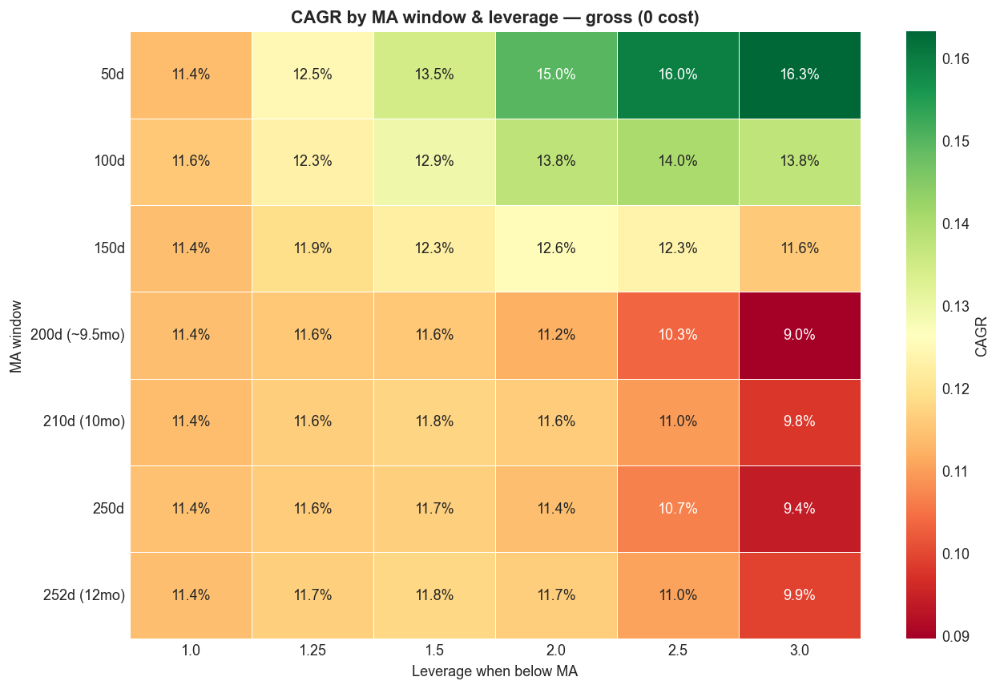

…but risk rises faster than return, so the **Calmar** and **drawdown** heatmaps
push you back to the low-leverage / no-leverage corner:

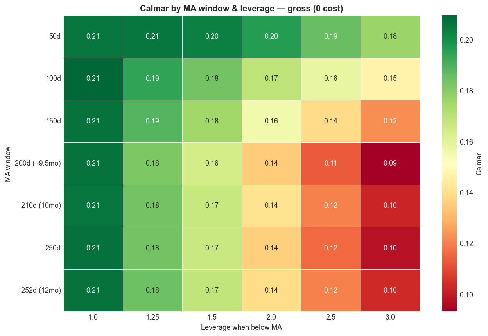
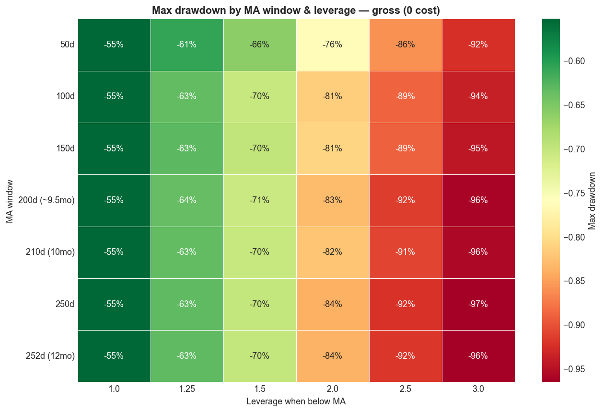

**Best moving-average window:** ~200 days is the most robust — long enough to
avoid whipsaws, short enough to react. **Best leverage:** 1× (none) on a
risk-adjusted basis.

---

## 13. ETF implementation results

Does synthetic leverage match reality? We compare `L × (S&P daily return)` to the
real ETFs over each ETF's life (`results/part6_etf_synth_vs_real.csv`):

| ETF | Target | Realized β | Annual tracking error | Synthetic-minus-ETF CAGR gap |
|---|---|---|---|---|
| SSO | 2× | **1.95** | 3.8% | +0.35%/yr |
| UPRO | 3× | **2.97** | 3.1% | +0.58%/yr |
| SPXL | 3× | **2.93** | 4.6% | +0.64%/yr |

* Realized betas are **very close to target** — the ETFs really do deliver their
  daily multiple.
* Our *costed* synthetic leverage **slightly overstates** the real ETFs (by
  0.3–0.6%/yr), i.e. the synthetic backtest is, if anything, a touch optimistic.
  So it **cannot** be hiding a worse real-world result — it understates the cost
  of leverage, and leverage still loses.

Running the full strategy with **real ETF returns** in the below-MA sleeve
(`results/part6_etf_strategy.csv`) confirms the same picture, including the
brutal drawdowns (real SSO 2× strategy: −83%; real UPRO/SPXL 3×: −67%, though
over a shorter, post-2009 sample that flattered leverage).

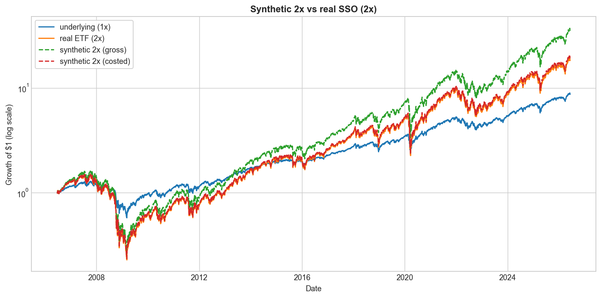

**Takeaway:** the synthetic-leverage conclusions are confirmed by real,
fee-paying, tracking-error-bearing ETFs.

---

## 14. Monte Carlo simulation

To understand *when* leverage helps and *when* it destroys wealth, we simulate
many random daily-return paths for a 1× asset with a known annual **drift** and
**volatility**, apply each leverage to the *same* paths (so "probability of
beating 1×" is a fair comparison), and compound daily over horizons of 1–20
years (`src/monte_carlo.py`, 10,000 paths, fixed seed). The full grid is
`results/part7_monte_carlo_grid.csv`.

**The optimal-leverage map (10-year horizon)** is the keystone result:


It has a clean **diagonal frontier**:

* **Top-right (low vol, high drift):** optimal leverage is 2–3×.
* **Bottom (high vol):** optimal leverage collapses to **1×** — at ≥40%
  volatility, *no* realistic drift justifies leverage.

Concrete cells (10-yr, median terminal wealth from $1):

| Regime | 1× | 2× | 3× | Note |
|---|---|---|---|---|
| Calm uptrend — drift 8%, vol 15% | 1.97 | 3.09 | 3.87 | leverage **wins**, but P(>50% DD) at 3× = **95%** |
| Moderate stress — drift 4%, vol 30% | 0.96 | 0.38 | 0.06 | leverage **loses** |
| Bad market — drift 0%, vol 40% | 0.45 | 0.04 | **0.00** | leverage = **near-total wipeout** |

And the probability that leverage beats 1× (10-yr):

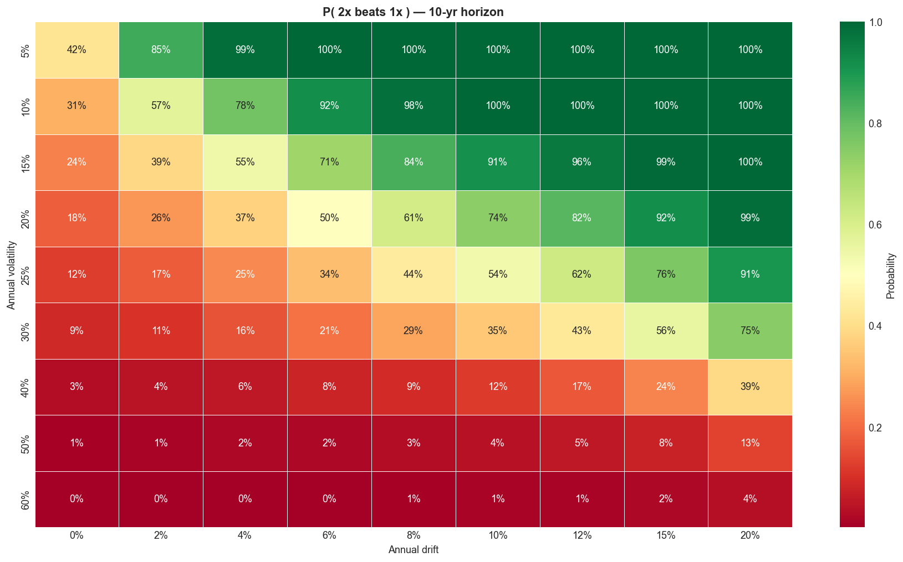

**The crucial connection.** Our strategy adds leverage when the index is *below*
its moving average. Empirically, below-trend periods are the **high-volatility,
low/negative-drift** regimes — the **bottom-left** of the map, where optimal
leverage is **1×**. *The strategy leverages precisely the regime in which the
mathematics says not to.* That single mismatch explains the entire historical
failure in Sections 11–12.

There is a second sting in the tail: even in the calm-uptrend cell where 3×
"wins" on median wealth, the probability of suffering a **>50% drawdown is 95%**.
Leverage that wins on the median can still be unholdable in practice.

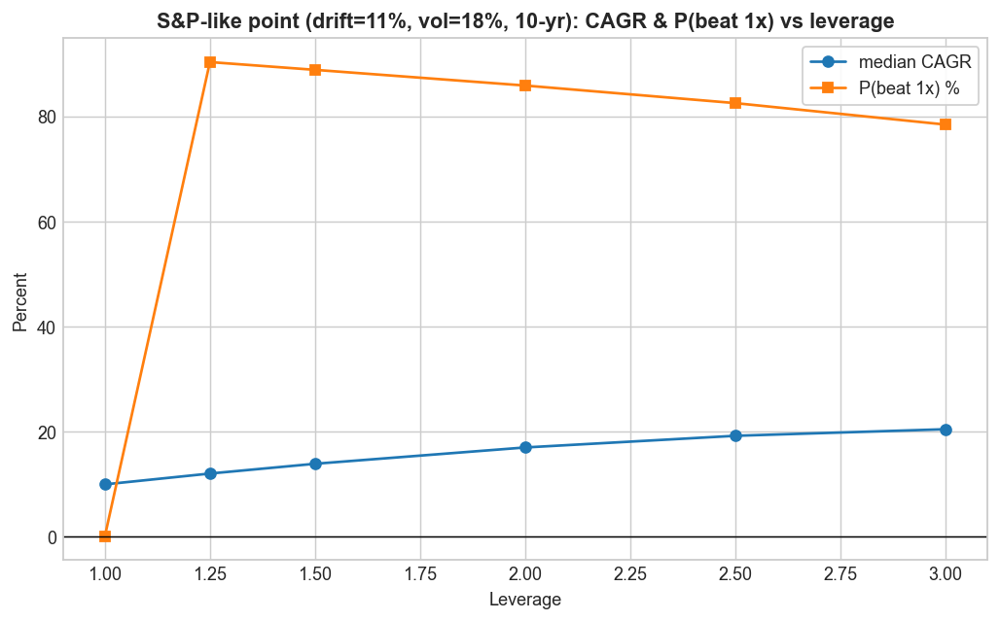

---

## 15. Volatility decay explanation

Volatility decay is the single mechanism behind every result above. Two pictures
of the *same* daily-leverage rule:


* **Left — a choppy, flat market** (+10%/−10% repeating). The index ends roughly
  where it started; 2× and 3× **bleed to zero**. The variance-drag term
  $\tfrac12 L^2\sigma^2$ is pure loss when there is no trend to compensate it.
* **Right — a smooth uptrend** (+0.4%/day). Here the drift dominates the drag, and
  leverage **amplifies the gains** as hoped.

The lesson: **leverage is a bet that drift will outrun the square of
volatility.** In calm uptrends it does; in volatile, trendless, or falling
markets it does not — and "below the moving average" is the label we put on
exactly those volatile, falling markets.

---

## 16. Results

Pulling it together (headline numbers in `results/headline_results.json`):

1. **Risk-adjusted, the leveraged strategy never wins.** 0 of 35 leveraged
   configs beat buy-and-hold on all four metrics; 0 beat it on Sharpe; this holds
   gross and net of costs.
2. **It does not beat the move-to-cash rule.** MA→cash has the best Sharpe (0.64)
   and shallowest drawdown (−21%) of anything tested. Leverage moves the opposite
   way.
3. **Best parameters:** ~200-day window; best risk-adjusted leverage is 1×
   (none). The "least-bad" genuine leverage is a mild 1.25× and still loses on
   Sharpe, Calmar, and drawdown.
4. **It is strongly regime-dependent (Section 18).** Across the full sample and
   the 2000-onward window it *hurt*; in the post-2009 / post-COVID windows of
   shallow V-shaped dips it *helped*.
5. **Real ETFs confirm the synthetic results**, and if anything synthetic
   leverage is slightly optimistic.
6. **Monte Carlo explains the mechanism:** leverage only pays in low-vol,
   positive-drift regimes; below-trend markets are high-vol; volatility decay
   does the rest.

---

## 17. Robustness checks

* **Costs.** Re-running the entire sweep with realistic costs (0.95% leveraged
  expense, T-bill+0.5% financing, 5 bps trading) only *worsens* the leveraged
  results: configs beating buy-and-hold on CAGR fall from 25 to 9, and the
  Sharpe/all-four counts stay at **0**. Financing and the leveraged expense ratio
  are a permanent headwind that scales with leverage.
* **Moving-average window.** The conclusion is stable across 50–252 day windows
  (Section 12 heatmaps); it is not an artefact of one lucky window.
* **Synthetic vs real leverage.** Section 13 — real ETFs match the synthetic
  multiple (β ≈ target) with only 0.3–0.6%/yr of extra drag.
* **Sub-periods.** Section 18 — the result is consistent (leverage hurts) in
  every sample that contains a *prolonged* bear (full, 1990+, 2000+), and only
  flips in samples dominated by fast rebounds.
* **Reporting consistency.** Sharpe/Sortino use the 13-week T-bill as the
  risk-free rate everywhere in the total-return analysis.

---

## 18. Period and episode analysis

**"Onward" periods, total-return data (`results/part5_period_analysis_TR.csv`).**
Note that because true daily total return starts in 1988, the 1950/1970/1980
cuts equal the full sample.

| Period | Buy & Hold CAGR | MA200→Cash CAGR | Lev 2× CAGR | Did 2× leverage help? |
|---|---|---|---|---|
| Full sample (1988+) | 11.5% | 10.2% | 11.2% | No (deeper DD: −83% vs −55%) |
| 1990 onward | 10.9% | 9.6% | 10.7% | No |
| 2000 onward | 8.3% | 7.5% | **7.0%** | **No** |
| 2010 onward | 14.3% | 10.0% | **17.3%** | **Yes** |
| Post-GFC (2009+) | 15.3% | 11.0% | **18.2%** | **Yes** |
| Post-COVID (2020-04+) | 20.4% | 15.4% | **24.3%** | **Yes** |

Leverage "helped" in **3 of 9** periods — and all three are overlapping subsets
of the same post-2009 bull market of shallow, quickly-recovered dips. The 2× rule
also carried a **−83% full-sample drawdown that took ~14 years to recover**, vs
~4.5 years for buy-and-hold.

**Historical episodes, price-only `^GSPC`** (so 1929/1987 are covered; dividends
excluded — `results/part5_episode_analysis_priceonly.csv`). Maximum loss in each
episode:

| Episode | Buy & Hold | MA200→Cash | Lev 2× | Lev 3× |
|---|---|---|---|---|
| 1929 crash | −76% | **−38%** | −95% | −99% |
| 1970s inflation bear | −42% | **−11%** | −65% | −80% |
| 1987 crash | −14% | **−6%** | −31% | −54% |
| Dot-com (2000–02) | −36% | **−15%** | −57% | −75% |
| Global Financial Crisis | −40% | **−9%** | −68% | −87% |
| 2022 rate-hike bear | −19% | **−15%** | −27% | −38% |
| **COVID crash (2020)** | −3.9% | −13.9% | **−2.3%** | −10% |

The pattern is stark: in **every sustained bear**, leverage made the loss
*much* worse and **move-to-cash protected capital best**. The **only** episode
where leverage shone was the **COVID crash** — a near-vertical V-shaped recovery,
which is also the only episode where the move-to-cash rule *underperformed*
(it whipsawed: sold near the bottom and missed the snap-back). That single
exception is the entire empirical case for the hypothesis, and it is a regime,
not a rule.

---

## 19. Limitations

1. **Total-return daily data starts in 1988.** We have one ~38-year sample with a
   particular sequence of bears. Long-history episodes use price-only data
   (excludes dividends), and pre-1988 daily *total* return was not used.
2. **Leveraged ETFs are young and period-biased** (2006–2009 inception, into a
   bull market). Their strong real-money CAGRs partly reflect that lucky start,
   not a general property of leverage.
3. **Daily-leverage modelling** assumes you can transact each day's exposure
   change at the close with a fixed cost; real intraday execution, borrow
   availability, and financing spreads vary through time.
4. **Monte Carlo uses constant drift/volatility with i.i.d. (and optionally
   fat-tailed) shocks.** Real markets have volatility clustering and regime
   persistence, which make leverage in bad regimes *worse* than the i.i.d. grid
   implies — so the i.i.d. "optimal leverage" map is, if anything, generous to
   leverage.
5. **No taxes, and a US-centric single index.** A 38-year US sample includes the
   strongest equity market of the era; outcomes elsewhere could differ.
6. **Signal is a single SMA rule.** Richer signals (volatility targeting,
   multiple timeframes) might condition leverage more intelligently — see Future
   work.

---

## 20. Conclusion and future work

**Does moving into daily-leveraged S&P 500 exposure during below-trend markets
improve long-term returns? No — not on any honest, risk-adjusted measure.**

Direct answers to the questions this project set out to settle:

* **Beat buy-and-hold?** No. 0 of 35 leveraged configs beat it on all four
  metrics; 0 on Sharpe; gross or net of costs.
* **Beat the move-to-cash rule?** No. MA→cash has the best Sharpe and by far the
  shallowest drawdowns.
* **Best moving average?** ~200 days (most robust). **Best leverage?** 1× — i.e.
  none, on a risk-adjusted basis.
* **Robust across time?** The *failure* is robust whenever the sample contains a
  prolonged bear; leverage only helped in post-2009 fast-rebound regimes.
* **Robust after costs?** Yes — costs make leverage strictly worse.
* **Confirmed by real ETFs?** Yes; synthetic leverage is mildly optimistic.
* **When does leverage help?** Low-volatility, positive-drift, trending-up
  markets. **When does volatility decay destroy returns?** High-volatility,
  trendless or falling markets — exactly the below-trend regimes the strategy
  targets.
* **Which drift/volatility makes 1.5×/2×/3× optimal?** Roughly: 3× only when
  vol ≲ 15% with healthy drift; 2× around vol ≈ 20% with strong drift; at vol
  ≳ 30% the optimum is 1× for any realistic drift.
* **Credible strategy or overfit noise?** Neither, exactly: it is a *coherent but
  mistaken* idea. Its rare wins are a specific recent regime, and the mechanism
  (leveraging high-volatility regimes) is structurally unsound. As a stand-alone
  strategy it is **not credible**.

The constructive lesson is the inverse of the hypothesis: **leverage belongs in
calm uptrends, not in volatile downtrends.** A strategy that leveraged *above* the
moving average (and de-risked below it) would be aligned with the volatility-decay
mathematics — the opposite of what we tested.

**Future work.**
* Test "leverage when *above* the MA, 1× below" — the volatility-aware inverse.
  **→ This is now done in Part II below, on data back to 1928, and it is a real
  improvement.**
* **Volatility targeting:** scale leverage by `target_vol / realized_vol` so
  exposure falls automatically when volatility spikes.
* Multi-asset / multi-timeframe trend signals and regime models with persistence.
* Longer and international total-return histories; explicit tax modelling.

---

# Part II — Following Faber Faithfully, and the Inverted Strategy

Part I tested *our* idea — leverage **below** trend — on 1988+ daily total
return, and rejected it. Two natural objections remain, and Part II answers both:

1. *"You didn't follow Faber's actual method or his long history."* Faber works
   **monthly**, with a **10-month SMA**, on S&P 500 total return back to **1901**.
   So we replicate that exactly and check our numbers against his.
2. *"The real lesson was to leverage the GOOD regime, not the bad one — did you
   test that?"* We now do, on daily total return back to **1928**.

### 21. Extended data (going back as far as the data allows)

| Series | Span | Use |
|---|---|---|
| **Shiller monthly** S&P price + dividends | 1871–present | reconstruct **monthly total return** for the Faber replication |
| **Reconstructed daily total return** | 1928–1988 | `^GSPC` daily price + Shiller dividend yield |
| **Real `^SP500TR`** | 1988–2026 | true daily total return (spliced on) |
| **`^IRX`** 13-week T-bill (+3.5% constant before 1960) | cash / financing |

**Is the reconstruction trustworthy?** We compare the reconstructed daily total
return to the *real* `^SP500TR` over their 1988–2026 overlap: annualised tracking
error **0.50%**, correlation **0.9996**, CAGR 11.41% vs 11.47%. The reconstructed
series is faithful, so the long daily history is safe to use. (Shiller and FRED/
Yahoo are standard public sources; Shiller's pre-1926 dividends come from the same
Cowles Commission data Faber cites.)

### 22. Replicating Faber (monthly, 10-month SMA → cash, 1901–2026)

| Metric | S&P 500 buy & hold | 10-month timing → cash |
|---|---|---|
| CAGR | 9.95% | 11.24% |
| Volatility (monthly, annualised) | 15.4% | 10.8% |
| Sharpe (vs T-bill) | 0.44 | **0.69** |
| **Max drawdown** | **−81.8%** | **−43.0%** |

**Faber's published figures:** S&P max drawdown **−83.66%** → timing **−42.24%**.
Our replication lands almost exactly on top of his (−81.8% / −43.0%), confirming
we are following the paper faithfully. (Our CAGRs run a little higher than his
1901–2012 numbers because our sample extends to 2026.) The classic result holds:
the trend rule keeps the returns and roughly **halves the drawdown**.


### 23. Longest daily baseline (1928–2026, 200-day SMA → cash)

| Metric | Buy & Hold 1× | MA200 → Cash |
|---|---|---|
| CAGR | 10.14% | 11.29% |
| Volatility | 18.9% | 12.6% |
| Sharpe | 0.40 | **0.60** |
| Max drawdown | −83.9% | **−46.2%** |
| Calmar | 0.12 | **0.24** |

Over the full 98-year daily history (including the 1929–32 crash, where the index
fell ~84%), the move-to-cash rule again wins on every measure. This is the
baseline the leveraged variants must beat.

### 24. Leverage on the index itself (daily, net of costs)

Holding *constant* daily leverage on the index over the long history:

| | CAGR |
|---|---|
| 1× (buy & hold) | 10.14% |
| Always 1.5× | 10.46% |
| Always 2.5× | 10.15% |
| Always 3× | **8.43%** |

Constant leverage barely helps at 1.5× and *loses* by 3× — the 1929 and 2008
crashes plus daily volatility decay overwhelm the extra drift. Naive "just hold
3×" is a bad idea over a full cycle.


### 25. How much leverage is *optimal*? (closed form + Monte Carlo)

The compound growth of L× leverage is approximately

$$g(L) = L\mu - \tfrac{1}{2}L^2\sigma^2,$$

with μ the **excess** drift and σ the volatility. This simple parabola gives two
exact, interpretable answers:

* **Growth-optimal (Kelly) leverage:** $L^* = \mu/\sigma^2$ — maximises long-run
  compound return.
* **Break-even leverage:** $L = 2\mu/\sigma^2 - 1$ — the leverage whose compound
  return *equals* 1×. Above it, variance drag makes leverage lose. (Kelly sits
  exactly halfway between 1× and break-even.)

For the S&P (excess drift **7.4%**, vol **18.9%**): **Kelly ≈ 2.07×**, break-even
**≈ 3.13×**. A fine-grid Monte Carlo confirms the closed form precisely — median
CAGR peaks at Kelly and returns to the 1× level at break-even:

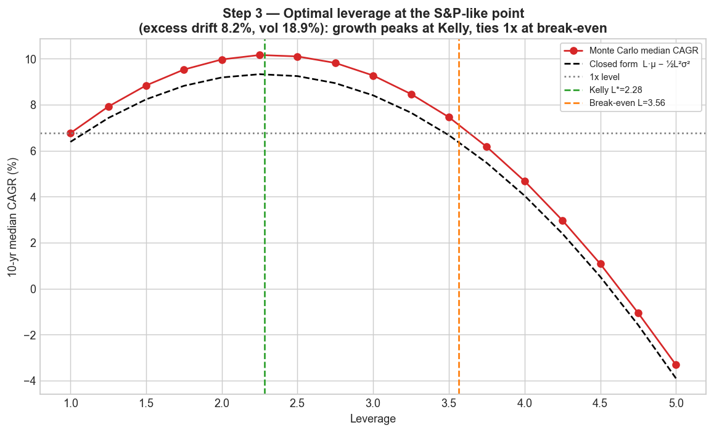

**What leverage matches the S&P?** The map below plots the **break-even daily
leverage** for every combination of trend and volatility. Reading a cell (or
tracing a labelled contour) tells you the leverage whose compound return exactly
*ties* 1×: on or below it, leverage matches or beats the index; above it,
volatility decay makes leverage **lose**. The S&P (★) sits near its ≈3.1×
break-even contour, with Kelly (≈2×) halfway between there and 1×.


The full surfaces (by trend and volatility) show the same diagonal frontier as
Part I — leverage is only rewarded where drift is high relative to volatility:

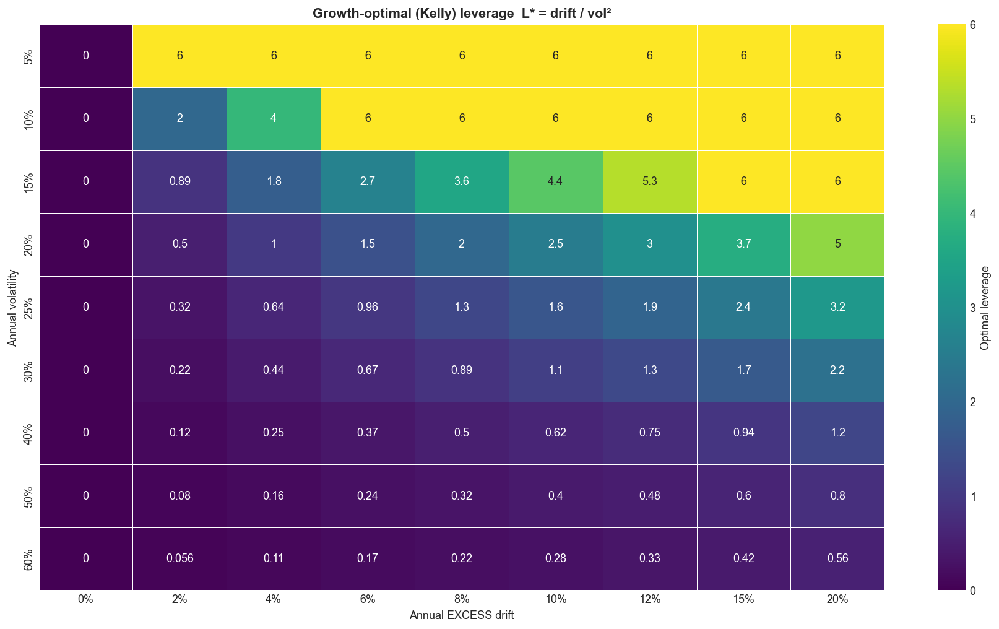
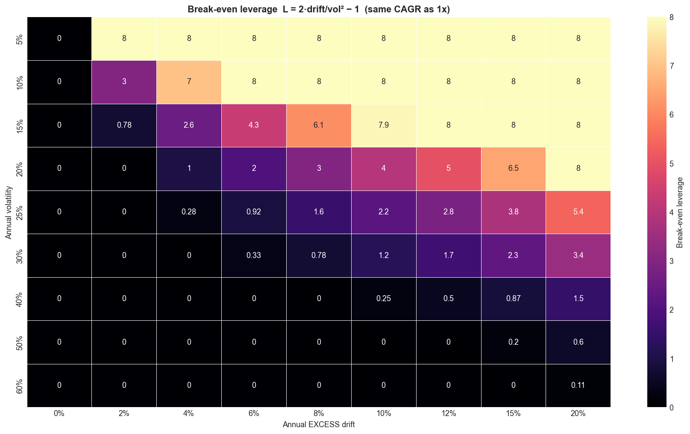

**Caveat:** this is the *iid-normal* optimum. Real returns have fat tails and
volatility clustering, which punish leverage more, so the *realised* best leverage
is lower than ~2× — as the backtests below confirm.

### 26. The inverted strategy: leverage ABOVE the MA, 1× below

Faber's own Figure 18 reports that below the 10-month SMA, returns are ~60% lower
and volatility ~30% higher. That is exactly the high-volatility regime where
leverage is worst. So we **invert** Part I's rule: leverage when **above** the MA
(calm, rising), drop to plain 1× when **below** (volatile, falling). Daily total
return 1928–2026, **net of realistic costs** (financing matters — we are
leveraged ~70% of the time):

| Strategy | CAGR | Sharpe | Max drawdown | Calmar |
|---|---|---|---|---|
| Buy & Hold 1× | 10.14% | 0.40 | −83.9% | 0.12 |
| MA200 → Cash | 11.29% | **0.60** | **−46.2%** | **0.24** |
| **Lev 1.5× ABOVE** | 11.88% | 0.43 | −85.7% | 0.14 |
| **Lev 2× ABOVE** | 14.18% | 0.47 | −89.2% | 0.16 |
| **Lev 3× ABOVE** | **17.48%** | 0.50 | −95.7% | 0.18 |
| *Lev 2× BELOW (Part I)* | *5.68%* | *0.21* | *−98.2%* | *0.06* |

**A closer look — 2000–2026 only.** The full-sample drawdowns above are dominated
by 1929 and 1987 (single days that a daily-rebalanced 3× cannot survive). Cutting
the sample to 2000 onward gives a more investable picture — same ranking, but with
*survivable* drawdowns:

| Strategy (2000–2026, net) | CAGR | Sharpe | Max drawdown | Calmar |
|---|---|---|---|---|
| Buy & Hold 1× | 8.30% | 0.41 | −55.3% | 0.15 |
| MA200 → Cash | 7.47% | **0.52** | **−20.6%** | **0.36** |
| Lev 1.5× ABOVE | 9.50% | 0.43 | −59.0% | 0.16 |
| Lev 2× ABOVE | 11.14% | 0.45 | −62.8% | 0.18 |
| Lev 3× ABOVE | **13.35%** | 0.47 | −73.5% | 0.18 |
| *Lev 2× BELOW (Part I)* | *5.70%* | *0.28* | *−85.9%* | *0.07* |

Post-2000 the inverted rule still beats buy-and-hold on CAGR, Sharpe, and Calmar,
and the worst-case drawdown is much tamer (3× peaks at −74% rather than −96%) — but
move-to-cash again has the best Sharpe, Calmar, and drawdown. The conclusion is
robust across both windows.


Three honest conclusions:

1. **Inverting the rule transforms it.** Leverage *above* the MA at 2× delivers
   **roughly double the Sharpe (0.47 vs 0.21) and ~2.5× the CAGR (14.2% vs 5.7%)**
   of the original leverage-*below* rule. Direction was the whole problem; Faber's
   volatility-clustering observation predicted exactly this.
2. **It beats buy-and-hold on CAGR, Sharpe, and Calmar — but not max drawdown.**
   Being leveraged *going into* fast crashes (1929, 1987, 2020) deepens the worst
   loss to −86%…−96%. Daily 3× can be nearly wiped out by a single crash day even
   with a trend overlay (e.g. a −22% day at 3× is −66% in one day). High leverage
   buys higher compound returns at the price of an almost un-survivable drawdown.
3. **The plain move-to-cash rule still wins on pure risk-adjusted terms** —
   highest Sharpe (0.60) and Calmar (0.24), shallowest drawdown (−46%).
   Leverage-above-MA is the route to *higher absolute* returns with
   better-than-buy-hold risk-adjustment, for an investor who can genuinely
   tolerate deep drawdowns; it is **not** a free lunch over move-to-cash.

### 27. Revised overall conclusion

* **Leverage the *bad* regime (Part I):** clearly wrong — it concentrates leverage
  in the highest-volatility periods and destroys risk-adjusted returns.
* **Leverage the *good* regime (Part II):** the right direction — it beats
  buy-and-hold on return, Sharpe, and Calmar across ~100 years, because it
  leverages the low-volatility, positive-drift regime the math actually rewards.
* **But neither leveraged rule beats simple move-to-cash on risk-adjusted terms**,
  and high leverage still courts catastrophic drawdowns. The most robust takeaway
  is Faber's original one — trend-following is a *risk-reduction* tool — with the
  refinement that *if* you add leverage, add it above the trend (modestly,
  ~1.5–2×), never below it.

A natural next step (left for future work) is **volatility targeting**: scale the
leverage continuously by `target_vol / realized_vol` so exposure falls
automatically as volatility rises, which should tame the deep drawdowns that the
fixed-leverage inverted rule still suffers.

---

### Reproducibility

```bash
pip install -r requirements.txt
python run_all.py            # Part I: tables in results/ + charts in charts/
python run_faber_leverage.py # Part II: Faber replication, surfaces, inverted strategy
python build_notebooks.py    # rebuilds notebooks/01..09 from source
python -m pytest tests/ -q   # 11 fast sanity tests (vol-decay, no look-ahead, metrics)
python build_pdf.py          # optional: rebuild this PDF (pip install markdown-pdf pymupdf)
```

All figures are PNGs in `charts/`; all numbers are in `results/` (Part I summary
`results/headline_results.json`, Part II `results/headline_faber.json`). Data is
cached in `data/raw` (including the Shiller spreadsheet). Random seeds are fixed
in `src/config.py`.

*Educational research only — not investment advice.*
