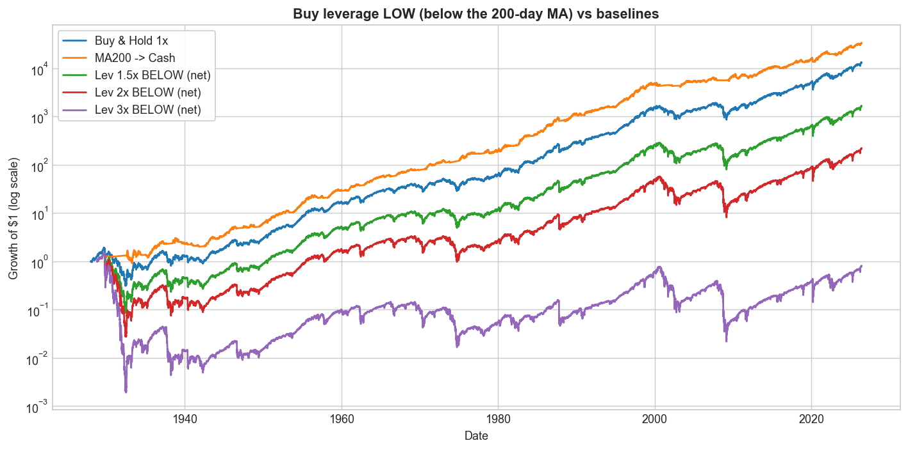
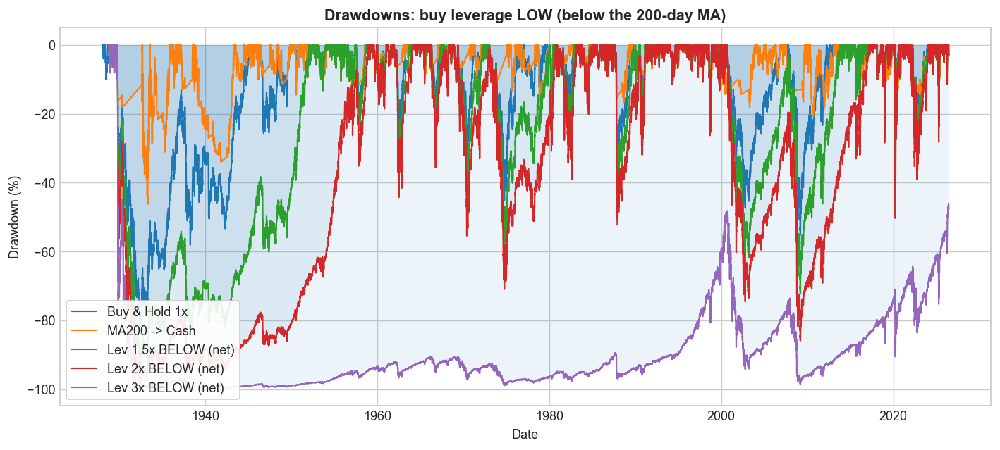

# Trend Following, Leveraged Re-Entry, and Volatility Decay

*S&P 500 total return. One signal only: the 200-day moving average (the daily
equivalent of Faber's 10-month rule). Tested as far back as the data allows.*

**Data.** Total return throughout. Monthly S&P 500 total return back to 1901
(Shiller) for the Faber replication; a daily total-return series from 1928 for
everything else — real `^SP500TR` from 1988, and before that `^GSPC` price plus
the Shiller dividend yield (this reconstruction tracks the real series with
0.50%/yr error and 0.9996 correlation over 1988–2026). Cash earns the 13-week
T-bill (`^IRX`; a 3.5% constant before 1960). The trend signal is lagged one day,
so nothing uses information we could not have had.

---

## 1. Buy & hold vs the Faber moving-average rule

The rule: hold the S&P 500 while it is **above** its moving average; move to
**cash** while it is **below**. Faber uses the 10-month SMA on monthly data; we
use that, then its daily twin (the 200-day SMA).

**Monthly, 1901–2026** (Faber's exact setup):

| | S&P 500 buy & hold | 10-month timing → cash |
|---|---|---|
| CAGR | 9.95% | 11.24% |
| Volatility | 15.4% | 10.8% |
| Sharpe | 0.44 | **0.69** |
| Max drawdown | −81.8% | **−43.0%** |

(Faber's published drawdowns are −83.66% → −42.24%; we reproduce them to within a
point.)


**Daily, 200-day SMA, 1928–2026:**

| | Buy & Hold 1× | MA200 → Cash |
|---|---|---|
| CAGR | 10.14% | 11.29% |
| Volatility | 18.9% | 12.6% |
| Sharpe | 0.40 | **0.60** |
| Sortino | 0.56 | **0.84** |
| Max drawdown | −83.9% | **−46.2%** |
| Calmar | 0.12 | **0.24** |


The moving-average rule keeps essentially all of the return while cutting
volatility by a third and halving the worst drawdown, so its Sharpe, Sortino and
Calmar are all much higher. The 200-day MA adds clear risk-adjusted value.

---

## 2. Leverage returns

A daily **L× leveraged** return is simply that day's S&P 500 total return
multiplied by L, and then compounded day by day:

```
leveraged_return[t] = L × sp500_return[t]      (before fees / financing)
```

For example, the 2× series is just the daily S&P total return × 2, compounded.
Borrowed money costs the financing rate, and leveraged funds charge a fee (~0.9%/
yr); both are included below.

Holding **constant** daily leverage on the index, net of costs:

| | CAGR | Grew $1 to |
|---|---|---|
| 1× (buy & hold) | 10.14% | $13,021 |
| Always 1.5× | 10.46% | $17,378 |
| Always 2.5× | 10.15% | $13,110 |
| Always 3× | **8.43%** | $2,803 |


Constant leverage barely helps at 1.5× and *loses ground* by 3× — across a full
century (including 1929 and 2008), constant 3× ends below plain buy & hold and far
below the moving-average rule.

---

## 3. Volatility decay, and buying leverage at the lows

**Volatility decay.** A +10% day followed by a −10% day:

| | 1× | 2× | 3× |
|---|---|---|---|
| Two-day return | −1.0% | −4.0% | −9.0% |

The market round-trips to roughly flat, but leverage loses — and the loss grows
with the *square* of leverage. The annual penalty is ≈ ½·L²·σ²: at 20%
volatility, ~2%/yr for 1×, **8%/yr for 2×, 18%/yr for 3×**.


**But decay only bites in choppy/falling markets.** In a one-directional rally —
like the rebound off a market bottom — leverage amplifies the gain. Forward
**1-year** total return if you had bought at the exact low:

| Bottom | 1× | 1.5× | 2× | 3× |
|---|---|---|---|---|
| GFC (2009-03-09) | +72% | +122% | +182% | **+339%** |
| COVID (2020-03-23) | +78% | +132% | +198% | **+372%** |
| 2022 (2022-10-12) | +23% | +35% | +47% | +72% |
| 2025 tariff selloff (2025-04-08) | +39% | +61% | +87% | **+146%** |


Leverage can work strongly in your favour **if you time it** — buying into the
recovery off a low. (The low, of course, is only obvious in hindsight.)

---

## 4. The leverage at which the total return goes flat

For a given trend (the 1× CAGR `g`) and volatility `σ`, the compound return of L×
leverage is `L·μ − ½·L²·σ²`. Setting it to zero gives the leverage at which
volatility decay exactly cancels the trend, so the **total return is flat (0%)**:

```
L_zero = 2·g / σ²  + 1
```

Below it, leverage still grows; above it, leverage **loses money**. The map below
plots `L_zero` for every combination of trend and volatility. For the S&P over the
**last 10 years** (CAGR 15.3%, volatility 18.1%) the flat point is **≈ 10×** — so a
hypothetical "10× S&P" would have gone essentially nowhere despite a strong decade,
while higher still would have bled toward zero.


(For reference, the leverage that merely *ties* 1× buy & hold is lower —
≈ 3.1× for the S&P — and the growth-maximising level is ≈ 2×; see
`charts/F3_breakeven_leverage_map.png` and `charts/F3_optimal_leverage_curve.png`.)

---

## 5. The switching strategy: buy leverage low, sell high

Use the 200-day MA to switch between leveraged and ordinary exposure. The
intuitive version — motivated by the bought-the-low returns in §3 — is to **buy
leverage when the market is low** (below the MA, "on sale") and drop back to plain
1× when it is high (above the MA). Daily total return, 1928–2026, net of costs:

| Strategy | Grew $1 to | CAGR | Vol | Sharpe | Sortino | Max DD | Calmar |
|---|---|---|---|---|---|---|---|
| Buy & Hold 1× | $13,021 | 10.1% | 18.9% | 0.40 | 0.56 | −83.9% | 0.12 |
| MA200 → Cash | $33,090 | 11.3% | 12.6% | **0.60** | **0.84** | **−46.2%** | **0.24** |
| Lev 1.5× below MA | $1,635 | 7.9% | 24.7% | 0.27 | 0.38 | −94.3% | 0.08 |
| Lev 2× below MA | $217 | 5.7% | 31.0% | 0.21 | 0.29 | −98.2% | 0.06 |
| Lev 3× below MA | **$0.79** | −0.2% | 44.3% | 0.13 | 0.19 | −99.9% | −0.00 |




Buying leverage low gets **worse** as leverage rises — 1.5× below trails buy &
hold, 2× below turns $1 into $217 (vs $13,021), and 3× below actually *loses
money* ($1 → $0.79) with a −99.9% drawdown. The reason: the 200-day MA does not
buy the bottom. It flags "below trend" at the *start* of a decline, when the
market is highly volatile and often still falling (1929, 2000–02, 2008) — exactly
where volatility decay is worst.

---

## 6. The other way round: leverage the uptrend

So we check the opposite switch — **leverage when the market is ABOVE the MA**
(the calm, rising regime) and drop to plain 1× when it falls below. Same data,
same costs:

| Strategy | Grew $1 to | CAGR | Vol | Sharpe | Sortino | Max DD | Calmar |
|---|---|---|---|---|---|---|---|
| Buy & Hold 1× | $13,021 | 10.1% | 18.9% | 0.40 | 0.56 | −83.9% | 0.12 |
| MA200 → Cash | $33,090 | 11.3% | 12.6% | **0.60** | **0.84** | **−46.2%** | **0.24** |
| Lev 1.5× above MA | $55,471 | 11.9% | 23.6% | 0.43 | 0.60 | −85.7% | 0.14 |
| Lev 2× above MA | $402,863 | 14.2% | 28.9% | 0.47 | 0.66 | −89.2% | 0.16 |
| Lev 3× above MA | **$6,429,403** | **17.5%** | 40.4% | 0.50 | 0.71 | −95.7% | 0.18 |


Leveraging the uptrend gets **better** as leverage rises, beating buy & hold on
CAGR, Sharpe, Sortino and Calmar at every level — though its maximum drawdown is
deeper than buy & hold (you are leveraged going *into* fast crashes), and it does
not beat the plain move-to-cash rule on a risk-adjusted basis.

It is the same idea pointed in opposite directions. At 2×, the two versions differ
by a factor of ~1,800× in final wealth ($402,863 above vs $217 below):


---

*Educational research only — not investment advice. Reproduce with
`python run_faber_leverage.py`; figures are in `charts/`, numbers in `results/`.*
