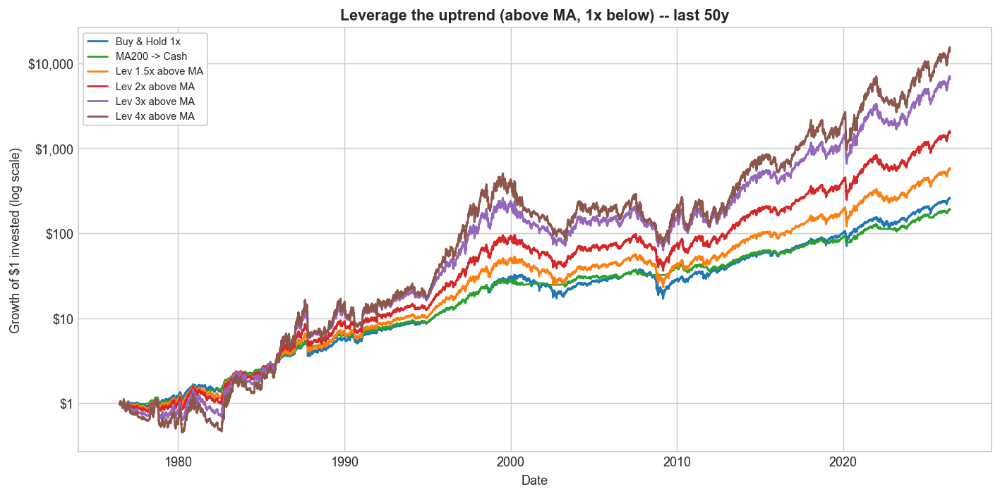
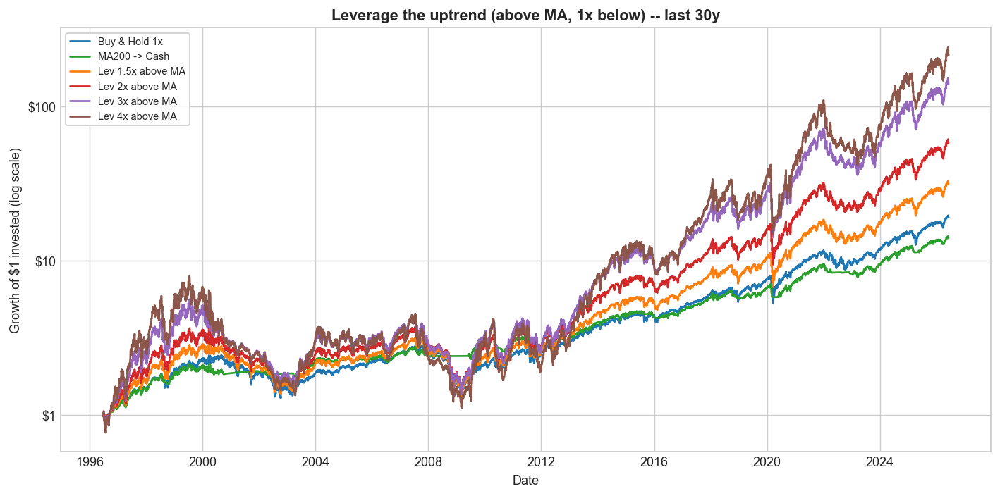
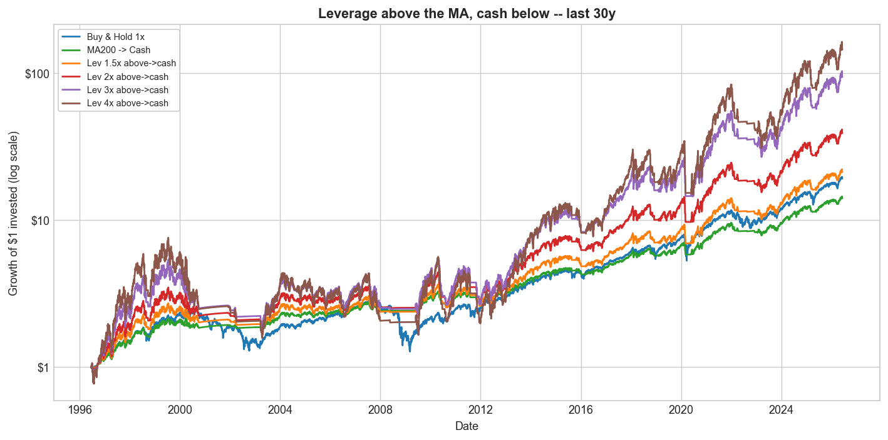
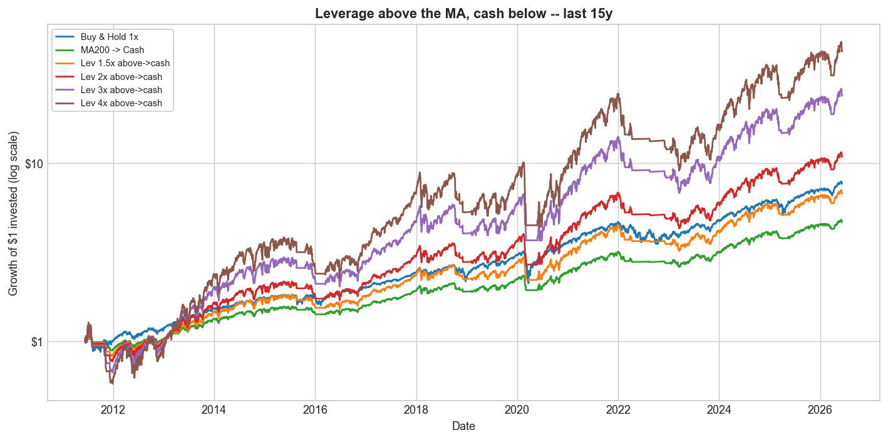
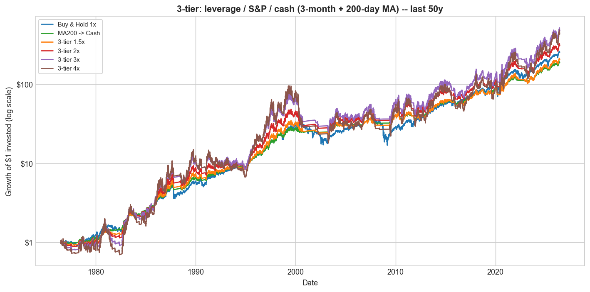
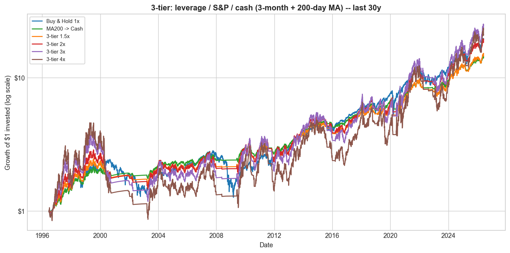
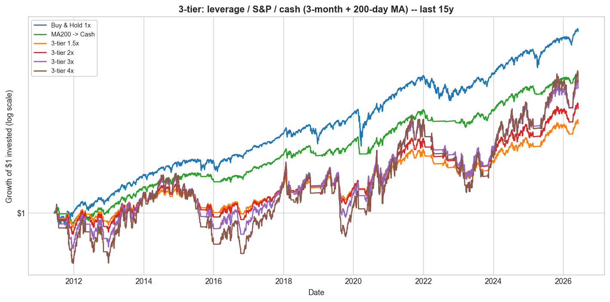

# Trend Following, Leveraged Re-Entry, and Volatility Decay

*S&P 500 total return. One signal only: the 200-day moving average (the daily
equivalent of Faber's 10-month rule). Tested as far back as the data allows.*

**Data.** Total return throughout. Monthly S&P 500 total return back to 1901
(Shiller) for the Faber replication; a daily total-return series from 1928 for
everything else — real `^SP500TR` from 1988, and before that `^GSPC` price plus
the Shiller dividend yield (this reconstruction tracks the real series with
0.50%/yr error and 0.9996 correlation over 1988–2026). Cash and the financing of
leverage use **real T-bill rates** throughout: `^IRX` (13-week T-bill) from 1960,
and the Ken French / Ibbotson **1-month T-bill** (monthly) before that, back to
1926 — so the risk-free covers the entire 1928+ daily sample (it averaged ~0% in
the 1930s–40s, ~1–3% in the 1950s, and ~3.2% over the full sample). The trend
signal is lagged one day, so nothing uses information we could not have had.

**How the ratios are computed** (all from *daily* returns, then annualized):
* **CAGR** — geometric: the constant yearly rate that turns the start wealth into
  the end wealth. "Grew $1 to" is the literal end value of $1.
* **Volatility** — annualized standard deviation of daily returns (× √252).
* **Sharpe** = annualized **mean** daily excess return over the T-bill ÷ volatility.
  It uses the *arithmetic mean*, **not** the CAGR. For high-volatility strategies
  the arithmetic mean sits far above the CAGR (by ≈ ½·vol², the variance drag), so
  Sharpe will **not** equal (CAGR − rf)/vol — e.g. the 4×-above rule's arithmetic
  mean is ~35% vs a 20.7% CAGR, giving Sharpe ≈ 0.56, not (20.7% − 3%)/52% ≈ 0.34.
  This is the standard definition and is correct; the volatility column lets you
  check it directly from the arithmetic mean.
* **Sortino** — same as Sharpe but the denominator counts only downside deviation
  (shortfalls below zero, averaged over *all* days).
* **Calmar** = CAGR ÷ |max drawdown|.
* **Information ratio (IR vs S&P)** = annualized mean of (strategy − S&P buy-&-hold)
  daily return ÷ its standard deviation (the tracking error). It is undefined for
  buy-and-hold itself (it *is* the benchmark).

---

## 1. Buy & hold vs the Faber moving-average rule

The rule: hold the S&P 500 while it is **above** its moving average; move to
**cash** while it is **below**. Faber uses the 10-month SMA on monthly data; we
use that, then its daily twin (the 200-day SMA).

**Monthly, 1901–2026** (Faber's exact setup):

| | S&P 500 buy & hold | 10-month timing → cash |
|---|---|---|
| CAGR | 9.95% | 10.89% |
| Volatility | 15.4% | 10.8% |
| Sharpe | 0.50 | **0.74** |
| Max drawdown | −81.8% | **−47.5%** |

(Faber's published drawdowns are −83.66% → −42.24%; we reproduce the same
qualitative halving — small differences come from extending the sample to 2026 and
using real, near-zero 1930s–40s cash rates.)


**Daily, 200-day SMA, 1928–2026:**

| | Buy & Hold 1× | MA200 → Cash |
|---|---|---|
| CAGR | 10.14% | 11.01% |
| Volatility | 18.9% | 12.6% |
| Sharpe | 0.43 | **0.63** |
| Sortino | 0.62 | **0.90** |
| Max drawdown | −83.9% | **−46.4%** |
| Calmar | 0.12 | **0.24** |


The moving-average rule keeps essentially all of the return while cutting
volatility by a third and halving the worst drawdown, so its Sharpe, Sortino and
Calmar are all much higher. The 200-day MA adds clear risk-adjusted value.

---

## 2. Leverage returns

A daily **L× leveraged** return is simply that day's S&P 500 total return
multiplied by L, and then compounded day by day:

```
leveraged_return[t] = L × sp500_return[t]      (before fees / financing)
```

For example, the 2× series is just the daily S&P total return × 2, compounded.
Borrowed money costs the financing rate, and leveraged funds charge a fee (~0.9%/
yr); both are included below.

Holding **constant** daily leverage on the index, net of costs:

| | CAGR | Grew $1 to |
|---|---|---|
| 1× (buy & hold) | 10.14% | $13,021 |
| Always 1.5× | 10.93% | $25,037 |
| Always 2× | 11.59% | $49,549 |
| Always 3× | 10.09% | $12,094 |
| Always 4× | **4.20%** | **$54** |


Constant leverage helps a little up to ~2×, then **runs out of road**: constant 3×
only matches buy & hold and constant 4× collapses to $54 (CAGR 4.2%) — across a
full century (including the 1929, 1987 and 2008 crashes) the volatility drag and
deep drawdowns overwhelm the extra exposure. Section 6 shows that *switching* the
leverage with the trend fixes this.

---

## 3. Volatility decay, and buying leverage at the lows

**Volatility decay.** A +10% day followed by a −10% day:

| | 1× | 2× | 3× |
|---|---|---|---|
| Two-day return | −1.0% | −4.0% | −9.0% |

The market round-trips to roughly flat, but leverage loses — and the loss grows
with the *square* of leverage. The annual penalty is ≈ ½·L²·σ²: at 20%
volatility, ~2%/yr for 1×, **8%/yr for 2×, 18%/yr for 3×**.


**But decay only bites in choppy/falling markets.** In a one-directional rally —
like the rebound off a market bottom — leverage amplifies the gain. Forward
**1-year** total return if you had bought at the exact low:

| Bottom | 1× | 1.5× | 2× | 3× | 4× |
|---|---|---|---|---|---|
| GFC (2009-03-09) | +72% | +122% | +182% | +339% | **+550%** |
| 2018 Q4 (2018-12-24) | +40% | +64% | +92% | +159% | **+244%** |
| COVID (2020-03-23) | +78% | +132% | +198% | +372% | **+605%** |
| 2025 tariff selloff (2025-04-08) | +39% | +61% | +87% | +146% | **+216%** |


Leverage can work strongly in your favour **if you time it** — buying into the
recovery off a low. (The low, of course, is only obvious in hindsight.)

---

## 4. The leverage at which the total return goes flat

For a given trend (the 1× CAGR `g`) and volatility `σ`, the compound return of L×
leverage is `L·μ − ½·L²·σ²`. Setting it to zero gives the leverage at which
volatility decay exactly cancels the trend, so the **total return is flat (0%)**:

```
L_zero = 2·g / σ²  + 1
```

Below it, leverage still grows; above it, leverage **loses money**. The map below
plots `L_zero` for every combination of trend and volatility. For the S&P over the
**last 10 years** (CAGR 15.3%, volatility 18.1%) the flat point is **≈ 10×** — so a
hypothetical "10× S&P" would have gone essentially nowhere despite a strong decade,
while higher still would have bled toward zero.


(For reference, the leverage that merely *ties* 1× buy & hold is lower —
≈ 3.1× for the S&P — and the growth-maximising level is ≈ 2×; see
`charts/F3_breakeven_leverage_map.png` and `charts/F3_optimal_leverage_curve.png`.)

---

## 5. The switching strategy: leverage the uptrend

Use the 200-day MA to switch between leveraged and ordinary exposure: **hold L×
leverage while the market is ABOVE the MA** — the calm, rising regime where the
one-directional gains seen in §3 happen — and drop back to plain 1× while it is
below. Each strategy is shown over the full history and the last 50 / 30 / 15
years (net of costs; the volatility column lets you reproduce the Sharpe):

| Horizon | Strategy | Grew $1 to | CAGR | Vol | Sharpe | Sortino | Calmar | Max DD | IR vs S&P |
|---|---|---|---|---|---|---|---|---|---|
| full (1928+) | Buy & Hold 1x | $13,021 | 10.1% | 18.9% | 0.43 | 0.62 | 0.12 | -83.9% | — |
| full (1928+) | MA200 -> Cash | $25,922 | 11.0% | 12.6% | 0.63 | 0.90 | 0.24 | -46.4% | 0.00 |
| full (1928+) | Lev 1.5x above MA | $70,781 | 12.2% | 23.6% | 0.47 | 0.66 | 0.14 | -85.7% | 0.47 |
| full (1928+) | Lev 2x above MA | $655,939 | 14.8% | 28.9% | 0.51 | 0.72 | 0.17 | -89.0% | 0.53 |
| full (1928+) | Lev 3x above MA | $17,050,454 | 18.7% | 40.4% | 0.55 | 0.77 | 0.20 | -95.5% | 0.56 |
| full (1928+) | Lev 4x above MA | $87,028,073 | 20.7% | 52.5% | 0.56 | 0.80 | 0.21 | -98.8% | 0.57 |
| last 50y | Buy & Hold 1x | $256.7 | 11.7% | 17.4% | 0.49 | 0.69 | 0.21 | -55.3% | — |
| last 50y | MA200 -> Cash | $189.4 | 11.1% | 11.7% | 0.60 | 0.85 | 0.54 | -20.6% | -0.11 |
| last 50y | Lev 1.5x above MA | $567.3 | 13.5% | 21.8% | 0.50 | 0.70 | 0.23 | -59.0% | 0.42 |
| last 50y | Lev 2x above MA | $1,533 | 15.8% | 26.7% | 0.53 | 0.74 | 0.25 | -62.8% | 0.48 |
| last 50y | Lev 3x above MA | $6,623 | 19.2% | 37.4% | 0.55 | 0.77 | 0.25 | -75.8% | 0.51 |
| last 50y | Lev 4x above MA | $14,106 | 21.1% | 48.6% | 0.55 | 0.78 | 0.24 | -86.1% | 0.52 |
| last 30y | Buy & Hold 1x | $19.1 | 10.4% | 19.1% | 0.50 | 0.70 | 0.19 | -55.3% | — |
| last 30y | MA200 -> Cash | $14.0 | 9.2% | 12.1% | 0.61 | 0.84 | 0.45 | -20.6% | -0.14 |
| last 30y | Lev 1.5x above MA | $31.5 | 12.2% | 23.4% | 0.52 | 0.72 | 0.21 | -59.0% | 0.43 |
| last 30y | Lev 2x above MA | $58.0 | 14.5% | 28.4% | 0.54 | 0.76 | 0.23 | -62.8% | 0.49 |
| last 30y | Lev 3x above MA | $140.6 | 18.0% | 39.2% | 0.56 | 0.78 | 0.24 | -75.8% | 0.52 |
| last 30y | Lev 4x above MA | $216.0 | 19.7% | 50.6% | 0.57 | 0.79 | 0.23 | -86.1% | 0.53 |
| last 15y | Buy & Hold 1x | $7.68 | 14.6% | 17.3% | 0.79 | 1.11 | 0.43 | -33.8% | — |
| last 15y | MA200 -> Cash | $4.68 | 10.9% | 11.8% | 0.81 | 1.11 | 0.61 | -18.0% | -0.32 |
| last 15y | Lev 1.5x above MA | $11.5 | 17.8% | 21.7% | 0.79 | 1.10 | 0.44 | -40.1% | 0.61 |
| last 15y | Lev 2x above MA | $18.6 | 21.6% | 26.7% | 0.81 | 1.12 | 0.47 | -45.8% | 0.68 |
| last 15y | Lev 3x above MA | $41.1 | 28.2% | 37.5% | 0.81 | 1.12 | 0.50 | -56.0% | 0.72 |
| last 15y | Lev 4x above MA | $73.2 | 33.2% | 48.7% | 0.81 | 1.10 | 0.52 | -64.5% | 0.73 |






**Reading the table.** Leveraging the uptrend beats buy & hold on CAGR, Sortino
and Calmar at every horizon, and matches its Sharpe in recent windows (last 15y:
Sharpe ≈ 0.81 at 2–3×, same as buy & hold, but far higher CAGR). The
**information ratio vs the S&P is strongly positive and rises with leverage**
(0.47 → 0.57 over the full century, up to 0.73 over the last 15 years), so the
leverage is adding genuine benchmark-relative return — note
that plain MA→cash has a **negative** IR in recent windows (−0.11 to −0.32): it
has *lagged* the index since the bull began. The cost is drawdown, which deepens
with leverage (−86% at 1.5× to −99% at 4× over the full century).

---

## 6. Does the MA switch add value over just holding leverage?

Is the switching doing the work, or could you just hold constant leverage? Holding
each level *constantly* (dotted) versus only **above the MA** (solid), 1928–2026:

| Strategy | Grew $1 to | CAGR | Vol | Sharpe | Sortino | Max DD | IR vs S&P |
|---|---|---|---|---|---|---|---|
| Buy & Hold 1x | $13,021 | 10.1% | 18.9% | 0.43 | 0.62 | -83.9% | — |
| Always 1.5x (constant) | $25,037 | 10.9% | 28.4% | 0.39 | 0.56 | -94.9% | 0.31 |
| **Lev 1.5x above MA** | $70,781 | 12.2% | 23.6% | 0.47 | 0.66 | -85.7% | 0.47 |
| Always 2x (constant) | $49,549 | 11.6% | 37.8% | 0.40 | 0.56 | -98.5% | 0.36 |
| **Lev 2x above MA** | $655,939 | 14.8% | 28.9% | 0.51 | 0.72 | -89.0% | 0.53 |
| Always 3x (constant) | $12,094 | 10.1% | 56.8% | 0.40 | 0.57 | -99.9% | 0.38 |
| **Lev 3x above MA** | $17,050,454 | 18.7% | 40.4% | 0.55 | 0.77 | -95.5% | 0.56 |
| Always 4x (constant) | $54 | 4.2% | 75.7% | 0.40 | 0.57 | -100.0% | 0.39 |
| **Lev 4x above MA** | $87,028,073 | 20.7% | 52.5% | 0.56 | 0.80 | -98.8% | 0.57 |


The switch adds enormous value at every level: the MA-switched version has higher
CAGR, Sharpe **and** a shallower drawdown than holding the same leverage all the
time. Constant leverage runs out of road as it rises — constant 3× merely *matches*
buy & hold ($12,094 vs $13,021) despite triple the volatility, and constant 4×
**collapses to $54** (CAGR 4.2%, a −100% interim drawdown). The switched versions
grow $1 to $656k (2×) and **$87 million** (4×). Constant leverage piles on
volatility (Sharpe stuck near 0.40) for little extra compound return; the trend
filter is what makes leverage pay.

---

## 7. Leverage → cash: sidestep the downturns

Instead of dropping to plain 1× below the MA, go all the way to **cash**. Over
full / 50 / 30 / 15-year horizons (net):

| Horizon | Strategy | Grew $1 to | CAGR | Vol | Sharpe | Sortino | Calmar | Max DD | IR vs S&P |
|---|---|---|---|---|---|---|---|---|---|
| full (1928+) | Buy & Hold 1x | $13,021 | 10.1% | 18.9% | 0.43 | 0.62 | 0.12 | -83.9% | — |
| full (1928+) | MA200 -> Cash | $25,922 | 11.0% | 12.6% | 0.63 | 0.90 | 0.24 | -46.4% | 0.00 |
| full (1928+) | Lev 1.5x above->cash | $140,875 | 13.0% | 18.9% | 0.57 | 0.80 | 0.21 | -62.9% | 0.17 |
| full (1928+) | Lev 2x above->cash | $1,305,593 | 15.6% | 25.3% | 0.57 | 0.81 | 0.21 | -74.8% | 0.34 |
| full (1928+) | Lev 3x above->cash | $33,940,576 | 19.5% | 37.9% | 0.58 | 0.81 | 0.22 | -89.8% | 0.48 |
| full (1928+) | Lev 4x above->cash | $173,246,846 | 21.5% | 50.5% | 0.58 | 0.82 | 0.22 | -97.6% | 0.52 |
| last 50y | Lev 2x above->cash | $988.6 | 14.8% | 23.4% | 0.53 | 0.74 | 0.32 | -46.9% | 0.23 |
| last 50y | Lev 4x above->cash | $9,101 | 20.0% | 46.9% | 0.54 | 0.75 | 0.25 | -79.3% | 0.45 |
| last 30y | Lev 2x above->cash | $39.1 | 13.0% | 24.2% | 0.54 | 0.74 | 0.28 | -46.9% | 0.18 |
| last 30y | Lev 4x above->cash | $145.4 | 18.1% | 48.4% | 0.54 | 0.75 | 0.23 | -79.3% | 0.43 |
| last 15y | Lev 2x above->cash | $10.9 | 17.3% | 23.5% | 0.73 | 1.00 | 0.47 | -37.0% | 0.21 |
| last 15y | Lev 4x above->cash | $43.0 | 28.6% | 47.0% | 0.74 | 1.01 | 0.45 | -63.0% | 0.57 |

*(Full per-horizon detail: `results/faber_lev_cash_horizons.csv`.)*





Going to cash (not 1×) below the trend **shallows the drawdown** versus
leverage-to-1× (2× above→cash: −75% over the full century, and only −37% / −47%
over the last 15 / 30 years, against the leverage-to-1× −46% / −63%). The price is
that in the recent bull its Sharpe (≈ 0.73 over 15 years) dips *below* buy & hold's
(0.79), because the cash periods missed dips that quickly recovered.

---

## 8. A three-tier rule: leverage → S&P → cash

A finer version uses a fast (3-month) MA *and* the slow (200-day) MA: **leverage**
above both, **plain 1× S&P** on a mild pullback (below the 3-month but above the
200-day), **cash** below the 200-day. Over full / 50 / 30 / 15-year horizons (net):

| Horizon | Strategy | Grew $1 to | CAGR | Vol | Sharpe | Sortino | Calmar | Max DD | IR vs S&P |
|---|---|---|---|---|---|---|---|---|---|
| full (1928+) | MA200 -> Cash | $25,922 | 11.0% | 12.6% | 0.63 | 0.90 | 0.24 | -46.4% | 0.00 |
| full (1928+) | 3-tier 1.5x | $83,682 | 12.4% | 17.4% | 0.57 | 0.80 | 0.21 | -58.3% | 0.12 |
| full (1928+) | 3-tier 2x | $460,493 | 14.3% | 22.5% | 0.57 | 0.80 | 0.21 | -67.8% | 0.26 |
| full (1928+) | 3-tier 3x | $5,842,068 | 17.4% | 33.0% | 0.55 | 0.78 | 0.21 | -84.1% | 0.40 |
| full (1928+) | 3-tier 4x | $22,624,488 | 19.0% | 43.6% | 0.55 | 0.77 | 0.20 | -94.0% | 0.45 |
| last 30y | 3-tier 2x | $18.4 | 10.2% | 21.4% | 0.46 | 0.63 | 0.21 | -49.3% | 0.02 |
| last 15y | Buy & Hold 1x | $7.68 | 14.6% | 17.3% | 0.79 | 1.11 | 0.43 | -33.8% | — |
| last 15y | 3-tier 2x | $5.95 | 12.7% | 20.9% | 0.60 | 0.82 | 0.39 | -32.3% | -0.06 |
| last 15y | 3-tier 4x | $8.05 | 15.0% | 40.4% | 0.51 | 0.69 | 0.27 | -54.5% | 0.22 |

*(Full per-horizon detail: `results/faber_lev_3tier_horizons.csv`.)*






The 3-tier rule has the shallowest drawdowns of any leveraged variant over the full
century (1.5×: −58%) and the best risk-adjusted profile *over the long run*. But
the extra de-risking **hurts in the recent bull** — over the last 15 years its
Sharpe falls to 0.51–0.65 (below buy & hold's 0.79) and even 4× barely beats 1×,
because it sat in cash/1× through dips that recovered fast. It is the most
conservative of the leveraged rules: best when bear markets are real and sustained,
worst when every dip is bought.

---

**An interesting cross-cutting result.** The three leveraged rules rank differently
by *era*. Over the full 1928+ history (which contains real, sustained bears), the
more defensive rules (3-tier, leverage→cash) have the better risk-adjusted numbers.
Over the **last 15 years** (a bull with only fast, V-shaped dips), the *least*
defensive rule — straight leverage-above-MA — wins, because any time spent in cash
or 1× was time out of a recovering market. There is no single best variant; the
right amount of de-risking depends on whether bear markets persist.

---

*Educational research only — not investment advice. Reproduce with
`python run_faber_leverage.py`; figures are in `charts/`, numbers in `results/`.*
