# Trend Following, Leveraged Re-Entry, and Volatility Decay

*S&P 500 total return. One signal only: the 200-day moving average (the daily
equivalent of Faber's 10-month rule). Tested as far back as the data allows.*

**Data.** Total return throughout. Monthly S&P 500 total return back to 1901
(Shiller) for the Faber replication; a daily total-return series from 1928 for
everything else — real `^SP500TR` from 1988, and before that `^GSPC` price plus
the Shiller dividend yield (this reconstruction tracks the real series with
0.50%/yr error and 0.9996 correlation over 1988–2026). Cash earns the 13-week
T-bill (`^IRX`; a 3.5% constant before 1960). The trend signal is lagged one day,
so nothing uses information we could not have had.

---

## 1. Buy & hold vs the Faber moving-average rule

The rule: hold the S&P 500 while it is **above** its moving average; move to
**cash** while it is **below**. Faber uses the 10-month SMA on monthly data; we
use that, then its daily twin (the 200-day SMA).

**Monthly, 1901–2026** (Faber's exact setup):

| | S&P 500 buy & hold | 10-month timing → cash |
|---|---|---|
| CAGR | 9.95% | 11.24% |
| Volatility | 15.4% | 10.8% |
| Sharpe | 0.44 | **0.69** |
| Max drawdown | −81.8% | **−43.0%** |

(Faber's published drawdowns are −83.66% → −42.24%; we reproduce them to within a
point.)

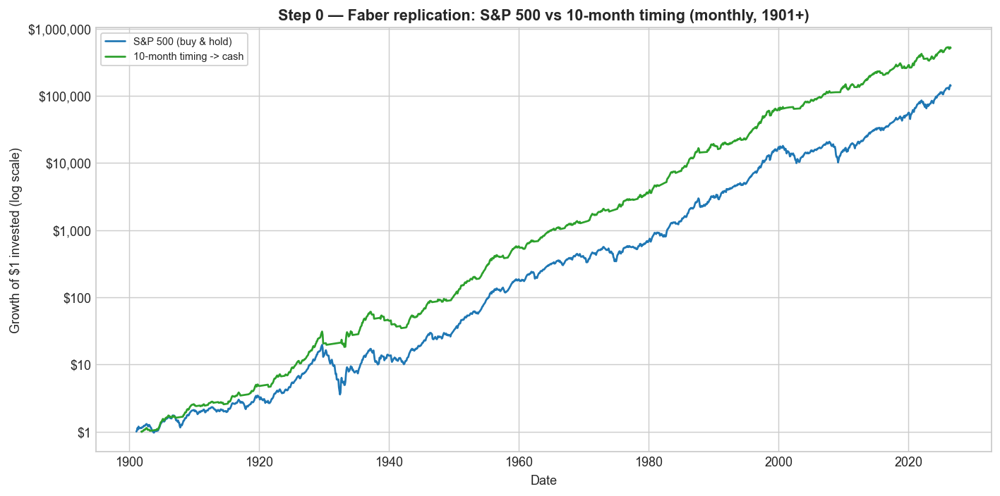

**Daily, 200-day SMA, 1928–2026:**

| | Buy & Hold 1× | MA200 → Cash |
|---|---|---|
| CAGR | 10.14% | 11.29% |
| Volatility | 18.9% | 12.6% |
| Sharpe | 0.40 | **0.60** |
| Sortino | 0.56 | **0.84** |
| Max drawdown | −83.9% | **−46.2%** |
| Calmar | 0.12 | **0.24** |

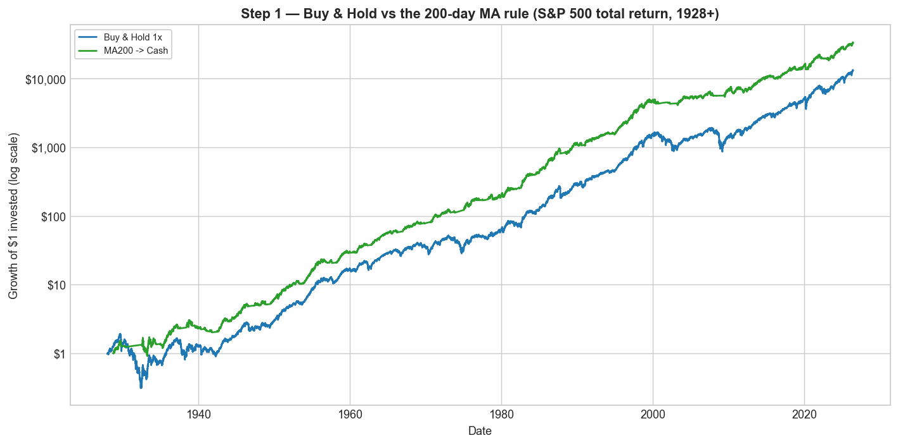
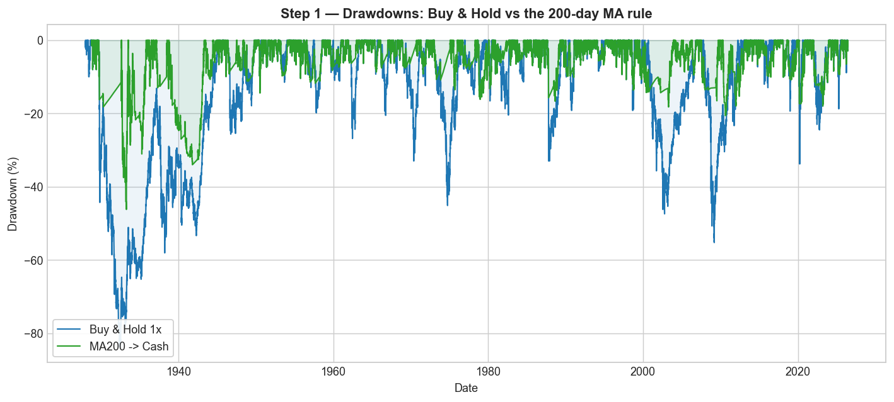

The moving-average rule keeps essentially all of the return while cutting
volatility by a third and halving the worst drawdown, so its Sharpe, Sortino and
Calmar are all much higher. The 200-day MA adds clear risk-adjusted value.

---

## 2. Leverage returns

A daily **L× leveraged** return is simply that day's S&P 500 total return
multiplied by L, and then compounded day by day:

```
leveraged_return[t] = L × sp500_return[t]      (before fees / financing)
```

For example, the 2× series is just the daily S&P total return × 2, compounded.
Borrowed money costs the financing rate, and leveraged funds charge a fee (~0.9%/
yr); both are included below.

Holding **constant** daily leverage on the index, net of costs:

| | CAGR | Grew $1 to |
|---|---|---|
| 1× (buy & hold) | 10.14% | $13,021 |
| Always 1.5× | 10.46% | $17,378 |
| Always 2.5× | 10.15% | $13,110 |
| Always 3× | **8.43%** | $2,803 |

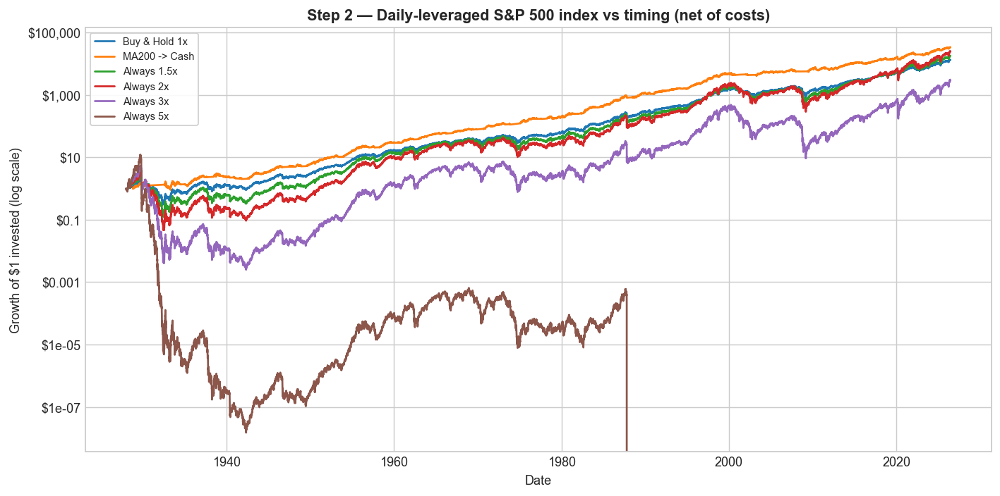

Constant leverage barely helps at 1.5× and *loses ground* by 3× — across a full
century (including 1929 and 2008), constant 3× ends below plain buy & hold and far
below the moving-average rule.

---

## 3. Volatility decay, and buying leverage at the lows

**Volatility decay.** A +10% day followed by a −10% day:

| | 1× | 2× | 3× |
|---|---|---|---|
| Two-day return | −1.0% | −4.0% | −9.0% |

The market round-trips to roughly flat, but leverage loses — and the loss grows
with the *square* of leverage. The annual penalty is ≈ ½·L²·σ²: at 20%
volatility, ~2%/yr for 1×, **8%/yr for 2×, 18%/yr for 3×**.

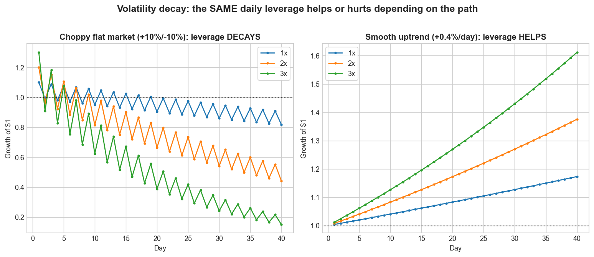

**But decay only bites in choppy/falling markets.** In a one-directional rally —
like the rebound off a market bottom — leverage amplifies the gain. Forward
**1-year** total return if you had bought at the exact low:

| Bottom | 1× | 1.5× | 2× | 3× |
|---|---|---|---|---|
| GFC (2009-03-09) | +72% | +122% | +182% | **+339%** |
| 2018 Q4 (2018-12-24) | +40% | +64% | +92% | **+159%** |
| COVID (2020-03-23) | +78% | +132% | +198% | **+372%** |
| 2025 tariff selloff (2025-04-08) | +39% | +61% | +87% | **+146%** |


Leverage can work strongly in your favour **if you time it** — buying into the
recovery off a low. (The low, of course, is only obvious in hindsight.)

---

## 4. The leverage at which the total return goes flat

For a given trend (the 1× CAGR `g`) and volatility `σ`, the compound return of L×
leverage is `L·μ − ½·L²·σ²`. Setting it to zero gives the leverage at which
volatility decay exactly cancels the trend, so the **total return is flat (0%)**:

```
L_zero = 2·g / σ²  + 1
```

Below it, leverage still grows; above it, leverage **loses money**. The map below
plots `L_zero` for every combination of trend and volatility. For the S&P over the
**last 10 years** (CAGR 15.3%, volatility 18.1%) the flat point is **≈ 10×** — so a
hypothetical "10× S&P" would have gone essentially nowhere despite a strong decade,
while higher still would have bled toward zero.


(For reference, the leverage that merely *ties* 1× buy & hold is lower —
≈ 3.1× for the S&P — and the growth-maximising level is ≈ 2×; see
`charts/F3_breakeven_leverage_map.png` and `charts/F3_optimal_leverage_curve.png`.)

---

## 5. The switching strategy: leverage the uptrend

Use the 200-day MA to switch between leveraged and ordinary exposure: **hold L×
leverage while the market is ABOVE the MA** — the calm, rising regime where the
kind of one-directional gains seen in §3 actually happen — and drop back to plain
1× while it is below. Daily total return, 1928–2026, net of costs:

| Strategy | Grew $1 to | CAGR | Vol | Sharpe | Sortino | Max DD | Calmar |
|---|---|---|---|---|---|---|---|
| Buy & Hold 1× | $13,021 | 10.1% | 18.9% | 0.40 | 0.56 | −83.9% | 0.12 |
| MA200 → Cash | $33,090 | 11.3% | 12.6% | **0.60** | **0.84** | **−46.2%** | **0.24** |
| Lev 1.5× above MA | $55,471 | 11.9% | 23.6% | 0.43 | 0.60 | −85.7% | 0.14 |
| Lev 2× above MA | $402,863 | 14.2% | 28.9% | 0.47 | 0.66 | −89.2% | 0.16 |
| Lev 3× above MA | $6,429,403 | 17.5% | 40.4% | 0.50 | 0.71 | −95.7% | 0.18 |
| Lev 5× above MA | **$11,648,321** | **18.2%** | 64.7% | 0.53 | 0.74 | −99.9% | 0.18 |


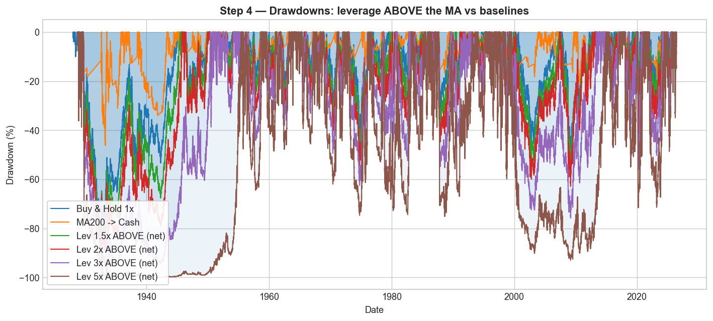

Leveraging the uptrend gets **better** as leverage rises — $1 grows to $402,863 at
2× and $11.6M at 5× (versus $13,021 for buy & hold) — and it beats buy & hold on
CAGR, Sharpe, Sortino and Calmar at every level. The trade-offs: maximum drawdown
deepens with leverage (−86% at 1.5× to −99.9% at 5×, because you are leveraged
going *into* fast crashes), and it still does not beat the plain move-to-cash rule
on a risk-adjusted basis.

---

## 6. Does the MA switch add value over just holding leverage?

Is the switching doing the work, or could you just hold constant leverage? Holding
each leverage level *constantly* (dotted) versus only **above the MA** (solid),
1928–2026, net:

| Strategy | Grew $1 to | CAGR | Vol | Sharpe | Max DD |
|---|---|---|---|---|---|
| Buy & Hold 1× | $13,021 | 10.1% | 18.9% | 0.40 | −84% |
| Always 1.5× (constant) | $17,378 | 10.5% | 28.4% | 0.35 | −95% |
| **Lev 1.5× above MA** | $55,471 | 11.9% | 23.6% | 0.43 | −86% |
| Always 2× (constant) | $23,866 | 10.8% | 37.8% | 0.36 | −99% |
| **Lev 2× above MA** | $402,863 | 14.2% | 28.9% | 0.47 | −89% |
| Always 3× (constant) | $2,803 | 8.4% | 56.8% | 0.36 | −100% |
| **Lev 3× above MA** | $6,429,403 | 17.5% | 40.4% | 0.50 | −96% |
| Always 5× (constant) | **$0 (wiped out)** | — | 94.6% | 0.36 | −100% |
| **Lev 5× above MA** | $11,648,321 | 18.2% | 64.7% | 0.53 | −99.9% |

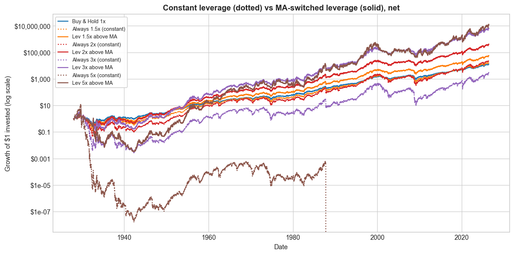

The switch adds enormous value: at every level, the MA-switched version has higher
CAGR, higher Sharpe **and** a shallower drawdown than holding the same leverage all
the time. Constant 5× was **wiped out** (a single −22% day in 1987 at 5× is a
−110% move); the switched 5× grew $1 to $11.6 million. Constant leverage just
piles risk on with little extra Sharpe; the trend filter is what makes leverage
pay.

---

## 7. Leverage → cash: sidestep the downturns

Instead of dropping to plain 1× below the MA, go all the way to **cash** — so the
strategy is leveraged in uptrends and completely out during below-trend slumps.
1928–2026, net:

| Strategy | Grew $1 to | CAGR | Vol | Sharpe | Max DD | Calmar |
|---|---|---|---|---|---|---|
| Buy & Hold 1× | $13,021 | 10.1% | 18.9% | 0.40 | −84% | 0.12 |
| MA200 → Cash | $33,090 | 11.3% | 12.6% | **0.60** | **−46%** | **0.24** |
| Lev 1.5× above → cash | $140,934 | 13.0% | 18.9% | 0.53 | −63% | 0.21 |
| Lev 2× above → cash | $1,023,603 | 15.3% | 25.3% | 0.53 | −75% | 0.20 |
| Lev 3× above → cash | $16,337,433 | 18.6% | 37.9% | 0.54 | −90% | 0.21 |
| Lev 5× above → cash | **$29,600,903** | **19.3%** | 63.1% | 0.54 | −99.8% | 0.19 |

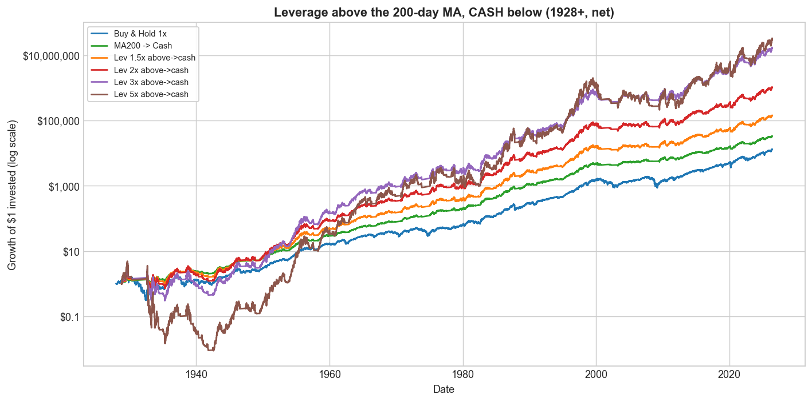

Going to cash (not 1×) below the trend both **raises returns and shallows the
drawdown** versus leverage-to-1×: e.g. 2× above→cash has a −75% drawdown at Sharpe
0.53, against the leverage-to-1× version's −89% at 0.47. Sharpe sits near 0.53–0.54
at every leverage (leverage scales the in-market return and risk together), so you
simply dial CAGR up or down with leverage. It still trails plain MA→cash on Sharpe
(0.60) and drawdown — the price of the much higher compound return.

---

## 8. A three-tier rule: leverage → S&P → cash

A finer version uses a fast (3-month) MA *and* the slow (200-day) MA: **leverage**
above both, **plain 1× S&P** on a mild pullback (below the 3-month but above the
200-day), **cash** below the 200-day. 1928–2026, net:

| Strategy | Grew $1 to | CAGR | Vol | Sharpe | Max DD | Calmar |
|---|---|---|---|---|---|---|
| Buy & Hold 1× | $13,021 | 10.1% | 18.9% | 0.40 | −84% | 0.12 |
| MA200 → Cash | $33,090 | 11.3% | 12.6% | **0.60** | **−46%** | **0.24** |
| 3-tier 1.5× | $87,949 | 12.4% | 17.4% | 0.53 | −58% | 0.21 |
| 3-tier 2× | $398,471 | 14.2% | 22.5% | 0.53 | −68% | 0.21 |
| 3-tier 3× | $3,426,219 | 16.7% | 33.0% | 0.52 | −84% | 0.20 |
| 3-tier 5× | $6,868,411 | 17.6% | 54.2% | 0.50 | −99% | 0.18 |

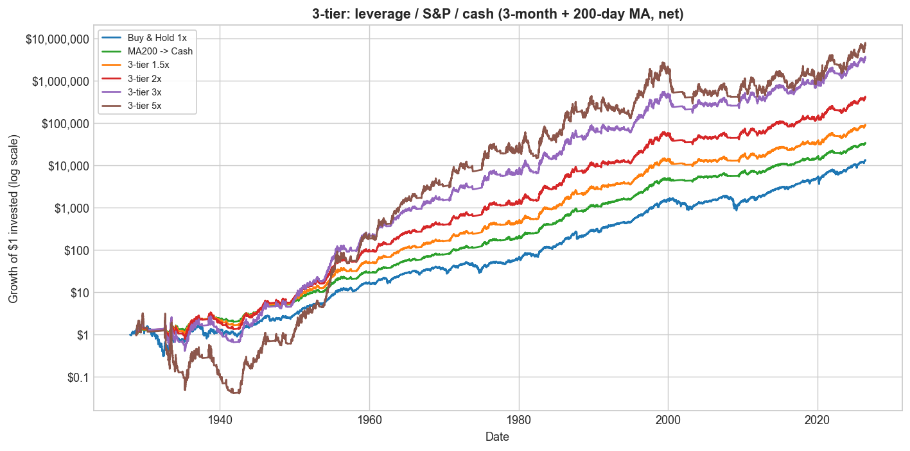

The middle "plain S&P" tier trims volatility and drawdown versus the straight
leverage→cash rule at low leverage (3-tier 1.5×: vol 17.4%, drawdown −58%, Calmar
0.21). Of all the leveraged variants, the 3-tier rule's risk-adjusted numbers come
closest to the plain MA→cash rule while keeping a much higher compound return.

---

## 9. Performance over recent horizons (last 50 / 30 / 15 years)

The 1928-start drawdowns are dominated by 1929/1987. Here is the leverage-the-
uptrend strategy over more recent windows (net of costs); volatility is shown so
the Sharpe can be checked directly.

**Last 50 years:**

| Strategy | Grew $1 to | CAGR | Vol | Sharpe | Max DD | Calmar |
|---|---|---|---|---|---|---|
| Buy & Hold 1× | $257 | 11.7% | 17.4% | 0.49 | −55% | 0.21 |
| MA200 → Cash | $189 | 11.1% | 11.7% | **0.60** | **−21%** | **0.54** |
| Lev 1.5× above MA | $567 | 13.5% | 21.8% | 0.50 | −59% | 0.23 |
| Lev 2× above MA | $1,533 | 15.8% | 26.7% | 0.53 | −63% | 0.25 |
| Lev 3× above MA | $6,623 | 19.2% | 37.4% | 0.55 | −76% | 0.25 |
| Lev 5× above MA | **$14,644** | **21.2%** | 60.0% | 0.56 | −93% | 0.23 |

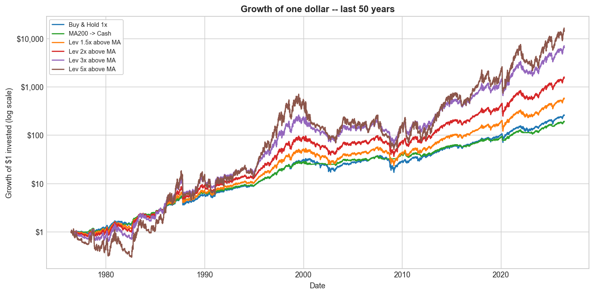

**Last 30 years:**

| Strategy | Grew $1 to | CAGR | Vol | Sharpe | Max DD | Calmar |
|---|---|---|---|---|---|---|
| Buy & Hold 1× | $19 | 10.4% | 19.1% | 0.50 | −55% | 0.19 |
| MA200 → Cash | $14 | 9.2% | 12.1% | **0.61** | **−21%** | **0.45** |
| Lev 1.5× above MA | $32 | 12.2% | 23.4% | 0.52 | −59% | 0.21 |
| Lev 2× above MA | $58 | 14.5% | 28.4% | 0.54 | −63% | 0.23 |
| Lev 3× above MA | $141 | 18.0% | 39.2% | 0.56 | −76% | 0.24 |
| Lev 5× above MA | **$209** | **19.5%** | 62.3% | 0.57 | −93% | 0.21 |

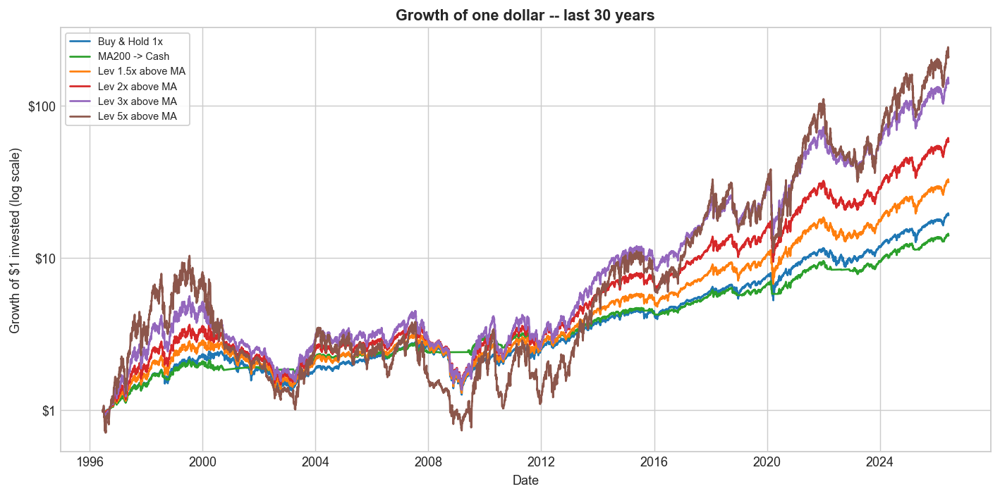

**Last 15 years:**

| Strategy | Grew $1 to | CAGR | Vol | Sharpe | Max DD | Calmar |
|---|---|---|---|---|---|---|
| Buy & Hold 1× | $7.7 | 14.6% | 17.3% | 0.79 | −34% | 0.43 |
| MA200 → Cash | $4.7 | 10.9% | 11.8% | 0.81 | **−18%** | **0.61** |
| Lev 1.5× above MA | $11.5 | 17.8% | 21.7% | 0.79 | −40% | 0.44 |
| Lev 2× above MA | $18.6 | 21.6% | 26.7% | 0.81 | −46% | 0.47 |
| Lev 3× above MA | $41.1 | 28.2% | 37.5% | 0.81 | −56% | 0.50 |
| Lev 5× above MA | **$104.7** | **36.5%** | 60.1% | 0.80 | −72% | 0.51 |

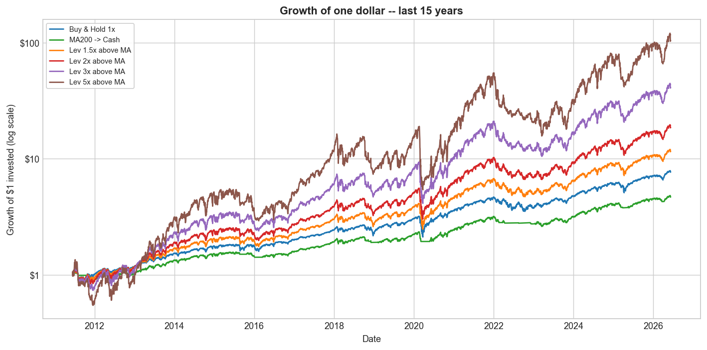

Across all three windows the leverage-the-uptrend strategy earns far higher
compound returns at **roughly the same Sharpe** as buy & hold (over the last 15
years, 5× grew $1 to ~$105 at Sharpe 0.80, versus buy & hold's $7.7 at 0.79). The
plain MA→cash rule keeps the best Sharpe, Calmar and drawdown throughout, but the
lowest dollar growth.

---

*Educational research only — not investment advice. Reproduce with
`python run_faber_leverage.py`; figures are in `charts/`, numbers in `results/`.*
